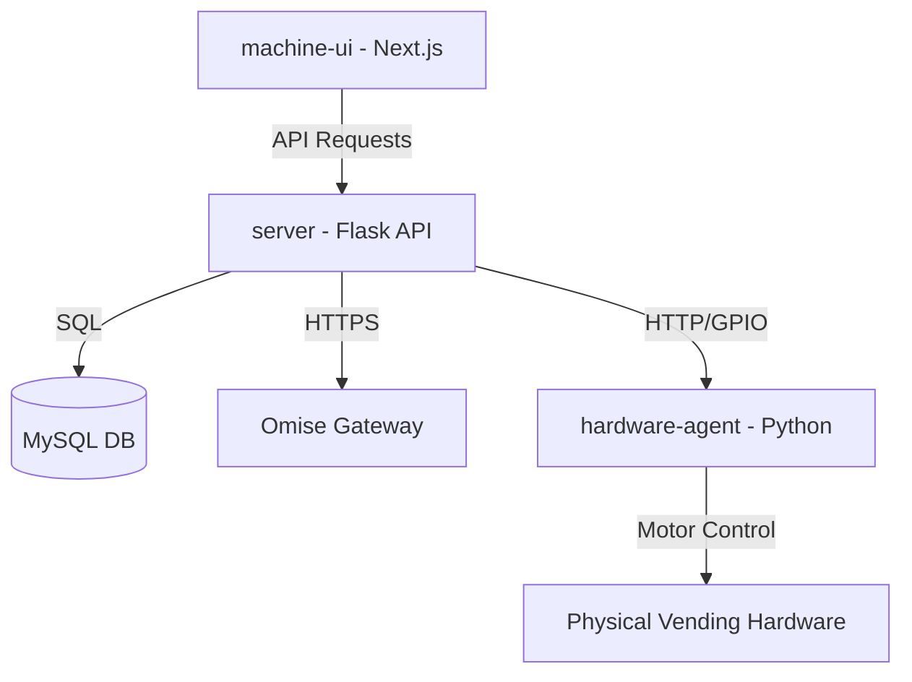

# 🤖 Smart Vending Machine - Full Stack Solution

[](https://opensource.org/licenses/MIT)
[](https://www.docker.com/)
[](https://nextjs.org/)
[](https://flask.palletsprojects.com/)
[](https://www.omise.co/)

A modern, production-ready Smart Vending Machine architecture featuring a **Next.js** touchscreen interface, a **Flask** microservice backend, **MySQL** inventory management, and a **Hardware Agent** for Raspberry Pi GPIO control. Integrated with **Omise** for secure Credit Card and PromptPay (QR) payments.

---

## 🏗️ Architecture Overview

The system is built on a distributed microservices architecture optimized for low-latency hardware interaction and secure payment processing.



- **`machine-ui`**: A high-performance Next.js application designed for 10.1" touchscreens. Handles UI state, Omise tokenization, and real-time polling.
- **`server`**: The central brain. Manages business logic, inventory verification, secure charge execution via Omise, and hardware coordination.
- **`db`**: Persistent storage for products, pricing, machine layouts, and transaction logs.
- **`hardware-agent`**: A lightweight service running on the Raspberry Pi 5 to handle GPIO signals for dispensing products.

---

## 🚀 Setup & Execution

The entire stack is containerized for seamless deployment.

### Prerequisites
- Docker & Docker Compose
- Omise Test Keys ([Sign up here](https://dashboard.omise.co/))

### 1. Environment Configuration
Copy the template and fill in your Omise keys:
```bash
cp .env.example .env
```
Edit `.env` and provide:
- `NEXT_PUBLIC_OMISE_PUBLIC_KEY`
- `OMISE_SECRET_KEY`

### 2. Launch the System
Run the following command to build and start all services:
```bash
docker compose up --build
```

- **Frontend**: [http://localhost:3000](http://localhost:3000)
- **API Backend**: [http://localhost:8000](http://localhost:8000)
- **API Documentation**: [http://localhost:8000/apidocs](http://localhost:8000/apidocs)
- **Hardware Agent**: [http://localhost:5000](http://localhost:5000)

---

## 🔐 Environment Variables

Standardized configuration for the production-ready stack:

| Variable | Description | Context |
| :--- | :--- | :--- |
| `NEXT_PUBLIC_OMISE_PUBLIC_KEY` | Omise Public Key for client-side tokenization | Frontend |
| `OMISE_SECRET_KEY` | Omise Secret Key (KEEP PRIVATE) | Backend |
| `NEXT_PUBLIC_API_URL` | Backend API Endpoint | Frontend |
| `AGENT_URL` | URL of the hardware agent | Backend |
| `DB_HOST` / `DB_USER` ... | MySQL Database Connection | Backend |

---

## 💳 Testing the Payment Flow

To test without physical cards or hardware:

1. **Auto-Tokenization**: Use the **"[Test] Simulate Visa Tap"** button in the UI. This uses a hardcoded test card (4242...) to generate a real Omise test token.
2. **PromptPay (QR)**: Select PromptPay in the UI. A scannable QR code will be generated. You can simulate the payment status update using:
   - **Webhook**: Configure an Omise webhook pointing to your `/api/buy/omise-webhook`.
   - **Manual Bypass**: POST the `charge_id` to `/api/buy/mock-pay` to force a "PAID" status in development.
3. **Hardware Trigger**: Check the `vending-pi` container logs. You will see `[Dispense] Motor Triggered` messages when the flow completes.

---

## 📖 API Documentation

The backend uses **Flasgger** to provide interactive OpenAPI/Swagger documentation. Navigate to `/apidocs` on the server to explore the endpoints.

**Key Endpoints:**
- `GET /api/health`: Comprehensive system health check.
- `GET /api/products`: Fetch inventory and pricing.
- `POST /api/buy/checkout`: Execute a payment (Token or Source).
- `GET /api/buy/status/<charge_id>`: Poll for payment completion.

---

## 📜 License
This project is licensed under the MIT License - see the LICENSE file for details.
