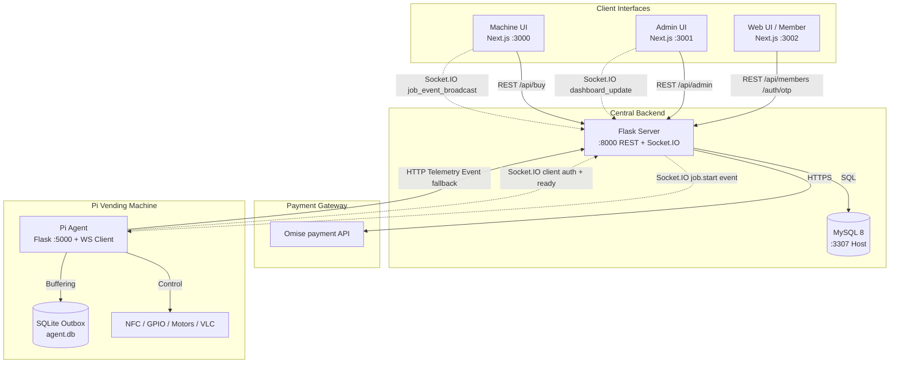
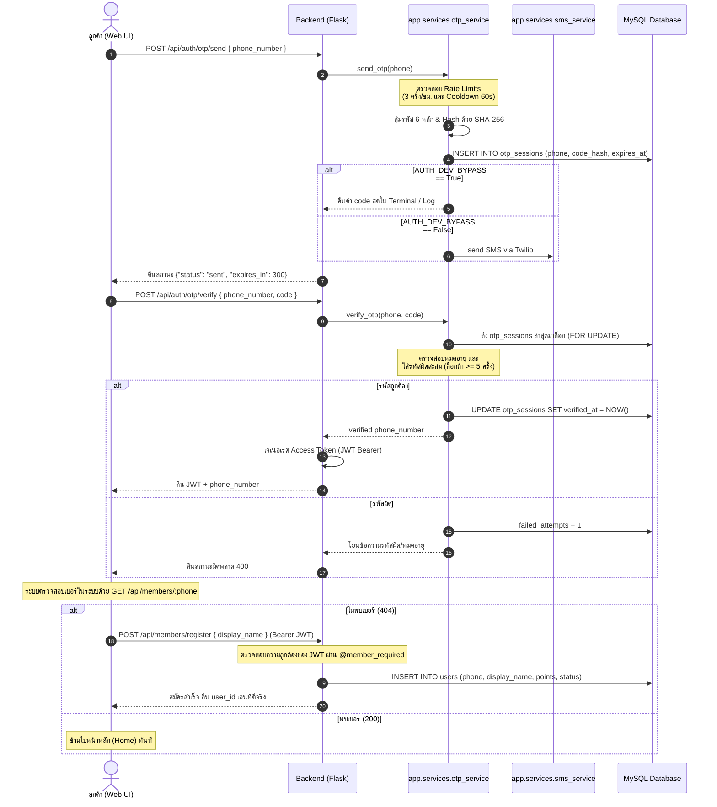
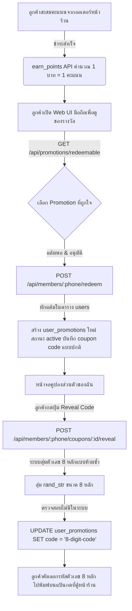
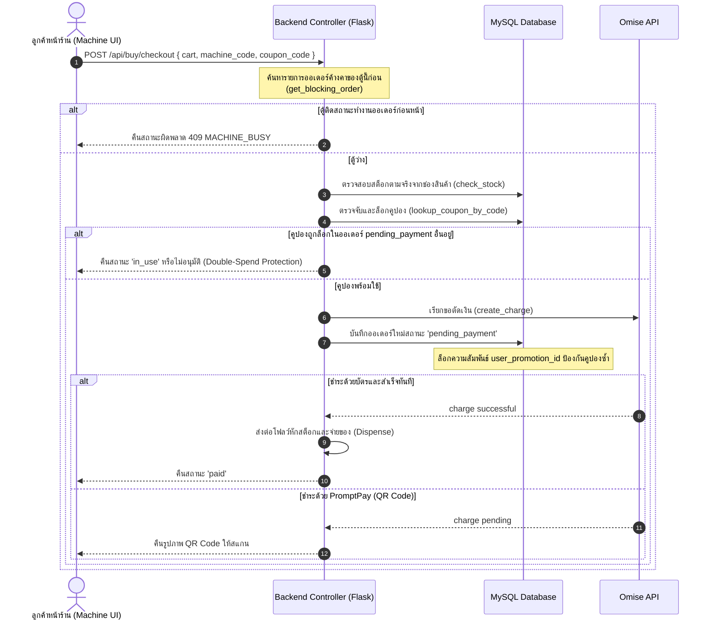
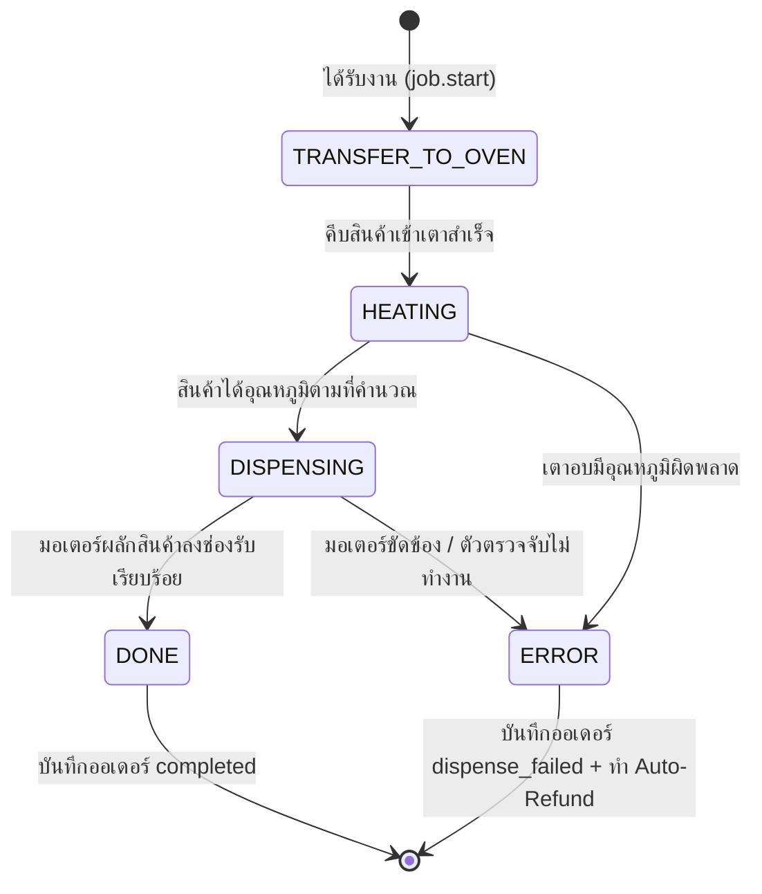
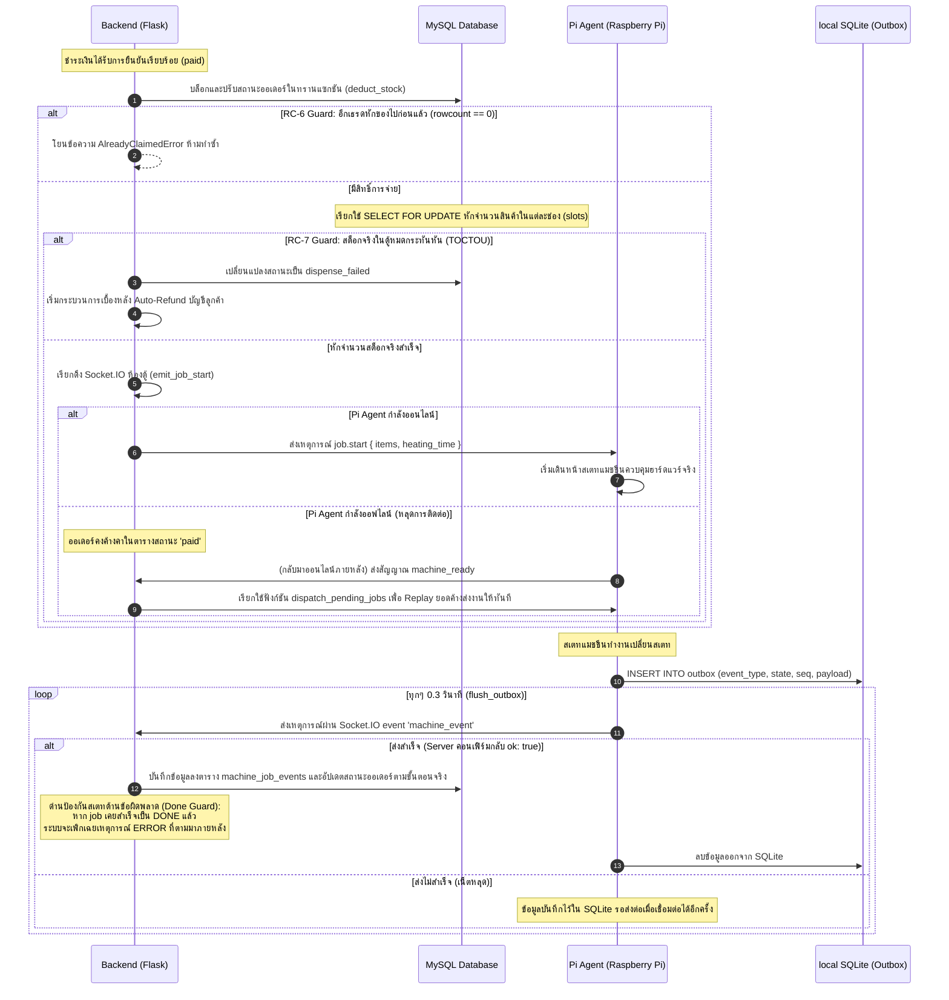

# Smart Vending Machine — แฟ้มคู่มือระบบและโฟลว์การทำงานฉบับละเอียด (README2)

เอกสารนี้รวบรวมรายละเอียดเชิงลึกเกี่ยวกับสถาปัตยกรรม ตัวแปรสภาพแวดล้อม โครงสร้างไฟล์ และ**โฟลว์การทำงาน (Workflows) ทั้งหมดแบบเจาะลึก** ของโครงการ **Smart Vending Machine (Capstone)** ตามที่ได้รับการออกแบบและพัฒนารวมกันในปัจจุบัน 

---

## สารบัญ

1. [ภาพรวมระบบและเทคโนโลยี (System Overview & Tech Stack)](#1-ภาพรวมระบบและเทคโนโลยี)
2. [สถาปัตยกรรมและการเชื่อมต่อ (Architecture & Port Maps)](#2-สถาปัตยกรรมและการเชื่อมต่อ)
3. [โครงสร้างโฟลเดอร์ของ Repository](#3-โครงสร้างโฟลเดอร์ของ-repository)
4. [ตัวแปรสภาพแวดล้อมและการตั้งค่า (.env)](#4-ตัวแปรสภาพแวดล้อมและการตั้งค่า)
5. [โฟลว์การยืนยันตัวตนและการสมัครสมาชิก (Authentication & Onboarding Flow)](#5-โฟลว์การยืนยันตัวตนและการสมัครสมาชิก)
6. [ระบบคะแนนสะสมและคูปองรหัสตัวเลข (Points & 8-Digit Numeric Coupon)](#6-ระบบคะแนนสะสมและคูปองรหัสตัวเลข)
7. [โฟลว์การซื้อสินค้าและการชำระเงิน (Checkout & Omise Payment Flow)](#7-โฟลว์การซื้อสินค้าและการชำระเงิน)
8. [ระบบจ่ายสินค้าและฮาร์ดแวร์แบบยืดหยุ่น (Resilient Hardware Dispensing & Telemetry)](#8-ระบบจ่ายสินค้าและฮาร์ดแวร์แบบยืดหยุ่น)
9. [งานพื้นหลังอัตโนมัติ (Background Sweeper Tasks)](#9-งานพื้นหลังอัตโนมัติ)
10. [คู่มือการรันระบบในสถานการณ์ต่างๆ (Running Scenarios)](#10-คู่มือการรันระบบในสถานการณ์ต่างๆ)
11. [การทดสอบและการแก้ปัญหาเบื้องต้น (Troubleshooting)](#11-การทดสอบและการแก้ปัญหาเบื้องต้น)
12. [ดัชนีไฟล์อ้างอิงหลัก (Index of Critical Files)](#12-ดัชนีไฟล์อ้างอิงหลัก)

---

## 1. ภาพรวมระบบและเทคโนโลยี

ระบบตู้จำหน่ายสินค้าอัจฉริยะ (Smart Vending Machine) พัฒนาขึ้นเพื่อให้บริการแบบ End-to-End โดยมีการแลกเปลี่ยนข้อมูลแบบ Real-time และระบบรักษาความปลอดภัยสูง ประกอบด้วยส่วนประกอบหลักดังนี้:

| บทบาท | เทคโนโลยี | รายละเอียดและหน้าที่สำคัญ |
| :--- | :--- | :--- |
| **API กลาง (Backend)** | Flask (Python 3) + Eventlet + python-socketio | จัดการ Business Logic, สต็อกสินค้า, การคำนวณราคา, ระบบแลก/ลดคูปอง, การเชื่อมต่อ Omise API, และการส่งงาน (Dispatch) ให้ฮาร์ดแวร์ผ่าน Socket.IO |
| **หน้าจอลูกค้าตู้ (Machine UI)** | Next.js 16.2.4 (React 19, Tailwind v4) | แสดงเมนูและสต็อกตามจริง, ตะกร้าสินค้า, ระบบชำระเงิน (Omise Token/Source), และหน้าจอแสดงความร้อน/การจ่ายของผ่าน Socket.IO |
| **แอปพลิเคชันสมาชิก (Web UI)** | Next.js (Responsive Mobile UI) | ระบบ OTP Login, สมัครสมาชิกใหม่, แดชบอร์ดคะแนนสะสม, ระบบแลกโปรโมชัน, และระบบสร้างรหัสคูปอง 8 หลักสำหรับใช้กดที่หน้าตู้ |
| **แดชบอร์ดแอดมิน (Admin UI)** | Next.js (Dashboard UI) | บริหารคลังสินค้า/ช่องสต็อกต่อตู้, CRUD สินค้าและตู้, ตรวจดูออเดอร์, จัดการคูปอง, ตรวจจับเหตุการณ์ความผิดปกติแบบ Real-time |
| **Hardware Agent** | Flask API + Socket.IO Client (Raspberry Pi/Docker) | ควบคุม GPIO, NFC Reader (MFRC522), มอเตอร์จ่ายของ, หลอดไฟ LED, เสียง VLC และมีระบบ SQLite Outbox สำหรับเก็บ Telemetry แบบออฟไลน์ |
| **ฐานข้อมูลหลัก** | MySQL 8 (Relational DB) | เก็บข้อมูลธุรกรรม, สต็อกช่อง, คูปอง, ประวัติสมาชิก, telemetry logs, และแอดมิน RBAC |
| **ระบบชำระเงิน** | Omise API | รับชำระผ่านบัตรเครดิต, PromptPay (QR Scannable) และมีระบบ webhook คอยคอนเฟิร์มยอด |

---

## 2. สถาปัตยกรรมและการเชื่อมต่อ

### 2.1 แผนภาพการไหลของข้อมูลหลัก



### 2.2 การจำลองพอร์ตที่ใช้บน Host (โหมด Docker มาตรฐาน)

| บริการ | Host Port | Container Internal Port | หน้าที่หลัก |
| :--- | :--- | :--- | :--- |
| **MySQL Database** | `localhost:3307` | `:3306` | จัดเก็บข้อมูลระบบหลัก |
| **vending-server (Backend)** | `http://localhost:8000` | `:8000` | REST API และ Gateway Socket.IO |
| **vending-machine-ui** | `http://localhost:3000` | `:3000` | หน้าจอลูกค้าหน้าร้าน (Kiosk) |
| **vending-admin-ui** | `http://localhost:3001` | `:3000` | แดชบอร์ดหลังบ้านของแอดมิน |
| **vending-web-ui** | `http://localhost:3002` | `:3000` | หน้าจอของแอปพลิเคชันสมาชิก (มือถือ) |
| **vending-pi (Agent)** | `http://localhost:5000` | `:5000` | ตัวแทนควบคุมตู้ (Mock ฮาร์ดแวร์ใน Docker) |
| **vending-swagger-ui** | `http://localhost:8081` | `:8080` | หน้าเว็บแสดงโครงสร้าง API (OpenAPI 2.0) |
| **Flasgger (บน server)** | `http://localhost:8000/apidocs` | — | Swagger สดบนเครื่อง Flask Server |

---

## 3. โครงสร้างโฟลเดอร์ของ Repository

```
Capstone-Project/
├── .env.example              # ตัวอย่างคอนฟิกสภาพแวดล้อมรวมศูนย์
├── docker-compose.yml        # สคริปต์ Docker Compose หลักแบบ 6 บริการ
├── swagger.yaml              # สัญญา API ตามมาตรฐาน OpenAPI 2.0
├── README.md                 # ภาพรวมและวิธีติดตั้ง (ภาษาอังกฤษ)
├── how-to-run.md             # คู่มือการลงทะเบียนตู้และการใช้งาน Docker
├── README2.md                # เอกสารเชิงลึกระบบนี้ (ภาษาไทย)
│
├── database/
│   └── init.sql              # สคริปต์สร้าง Schema และลง Seed ข้อมูลเริ่มต้น
│
├── server/                   # ซอร์สโค้ดของ Flask Backend
│   ├── main.py               # จุดสตาร์ทระบบ: eventlet runtime + background tasks
│   ├── app/
│   │   ├── factory.py        # แฟคทอรีสำหรับสร้างแอป Flask, CORS, และ Flasgger
│   │   ├── extensions.py     # ตัวจัดการ SQLAlchemy และ Alembic
│   │   ├── auth/             # คลาสลงรหัสและถอดรหัส JWT สมาชิก (`member_auth.py`)
│   │   ├── api/              # บลูปริ้นท์ REST API (buy, members, auth_otp, orders)
│   │   │   └── admin/        # บลูปริ้นท์ Admin REST API และ security decorators
│   │   ├── models/           # คลาสและโมเดล SQLAlchemy (User, Coupon, Order)
│   │   ├── services/         # ชั้นบริการ (omise, buy, hardware, OTP, SMS, coupon)
│   │   └── realtime/         # เกตเวย์ Socket.IO (`socketio_gateway.py`)
│   └── migrations/           # ประวัติการปรับเปลี่ยนฐานข้อมูล (Alembic)
│
├── client/
│   ├── agent/                # ตัวควบคุมฮาร์ดแวร์บน Raspberry Pi (หรือ Mock ใน Docker)
│   │   ├── agent.py          # จุดรันหลักของ Agent
│   │   ├── routes.py         # REST Endpoint ของ Agent (เช่น /jobs/start, /nfc/arm)
│   │   ├── ws_client.py      # ตัวเชื่อมและซิงก์ Socket.IO แบบยืดหยุ่นกลับไปยัง server
│   │   ├── machine.py        # ตัวควบคุมเสียง, ไฟ LED, หน้าจอ, และ NFC
│   │   ├── ws_outbox.py      # SQLite เก็บประวัติ Telemetry รอส่งกลับเมื่อออนไลน์
│   │   └── hardware_runner.py# ตัวรันสเตทแมชชีนควบคุมความร้อนและหน่วงเวลาการจ่ายสินค้า
│   └── kiosk/
│       ├── autostart.service # เทมเพลตสำหรับจดทะเบียน systemd service บน Pi
│       └── chromium.sh       # เชลล์สคริปต์สำหรับเปิดหน้าเว็บ machine-ui แบบเต็มหน้าจอ (Kiosk)
│
├── web/
│   ├── machine-ui/           # Next.js ของหน้าจอลูกค้าหน้าร้าน
│   ├── admin-ui/             # Next.js แดชบอร์ดจัดการของแอดมิน
│   └── web-ui/               # Next.js หน้าจอของระบบสมาชิก (มือถือ)
│
└── docs/diagrams/            # แฟ้มบันทึกไฟล์แผนภาพสถาปัตยกรรม (.mmd)
```

---

## 4. ตัวแปรสภาพแวดล้อมและการตั้งค่า (.env)

ไฟล์ `.env` ที่ root ของโปรเจกต์ทำหน้าที่ควบคุมทั้ง 6 บริการของ Docker Compose โดยกลุ่มตัวแปรที่สำคัญที่สุดที่ห้ามคลาดเคลื่อน ได้แก่:

1. **การเชื่อมต่อฐานข้อมูลหลัก**:
   * `DB_HOST=db` (สำหรับ container วิ่งหากัน) หรือ `DB_HOST=127.0.0.1` (สำหรับ Local dev นอก Docker)
   * `DB_PORT=3306` (ภายใน container) หรือ `DB_PORT=3307` (ชี้ไปที่ MySQL ของ host)
2. **คีย์สัญญากลางและรหัสลับ**:
   * `JWT_SECRET`: ใช้สำหรับเข้ารหัสและยืนยัน Access Token ของสมาชิกหลัง verify OTP
   * `KIOSK_SOCKET_SECRET`: ต้องตรงกันระหว่าง server และ Next.js `machine-ui` เพื่อใช้กรองการเข้าร่วมห้อง (Room) บน Socket.IO
   * `ADMIN_SOCKET_SECRET`: คีย์เข้าร่วมห้องแอดมินแบบความปลอดภัยสูง
3. **การทดสอบชำระเงิน**:
   * `OMISE_SECRET_KEY` และ `NEXT_PUBLIC_OMISE_PUBLIC_KEY`: สำหรับสร้าง charge และ Token บัตรเครดิต
   * `ALLOW_MOCK_PAY=1`: อนุญาตให้เรียก `/api/buy/mock-pay` เพื่อข้ามการจ่ายเงินจริงขณะพัฒนา
4. **ตัวตนของตู้สินค้า (Vending Identity)**:
   * `MACHINE_CODE` และ `MACHINE_TOKEN`: ต้องสอดคล้องกับฐานข้อมูลเพื่อให้ Agent ผ่านด่านรักษาความปลอดภัย Socket.IO

---

## 5. โฟลเดอร์การยืนยันตัวตนและการสมัครสมาชิก (Authentication & Onboarding Flow)

เพื่อความถูกต้องในการเก็บข้อมูล โครงการนี้ได้เลือกใช้สถาปัตยกรรมแบบ **"Deferred User Registration" (ชะลอการบันทึกข้อมูล)** เพื่อป้องกันการเกิดบัญชีผี (Ghost Users) ที่ยังไม่ได้ลงทะเบียนอย่างสมบูรณ์แบบ แผนภูมิและขั้นตอนจริงมีดังนี้:

### 5.1 ขั้นตอนแบบ Sequence Diagram



### 5.2 จุดควบคุมความปลอดภัยหลัก (Core Controls)
1. **การ Hash OTP**: backend จะนำ `salt + phone + code` มาผ่านกระบวนการ SHA-256 ก่อนเก็บลง `otp_sessions.code_hash` เพื่อป้องกันการรั่วไหลหากฐานข้อมูลโดนเจาะ
2. **Ghost User Prevention**: จะไม่มีข้อมูลใดๆ ในตาราง `users` จนกว่าขั้นตอนที่ 14 (การ onboard ด้วย `register`) จะเสร็จสิ้น
3. **Rate Limiting ป้องกันการสุ่มค้นหา (Brute-force Enumeration)**: 
   * `GET /api/members/<phone>` ถูกจำกัดไว้สูงสุดที่ **10 requests ต่อนาทีต่อ IP**
   * `POST /api/members/earn` ถูกจำกัดไว้สูงสุดที่ **20 requests ต่อนาทีต่อ IP**

---

## 6. ระบบคะแนนสะสมและคูปองรหัสตัวเลข (Points & 8-Digit Numeric Coupon)

เพื่อลดข้อจำกัดของแผงปุ่มกดทางกายภาพของตู้จำหน่ายสินค้า (Vending physical numeric-only keypad) ซึ่งรองรับเฉพาะค่าที่เป็นตัวเลข ระบบจึงได้พัฒนา **ระบบแปลงรหัสคูปองส่วนตัวให้เป็นรหัสสุ่มตัวเลข 8 หลัก** เพื่อความเข้ากันได้ 100%

### 6.1 แผนภาพลำดับการทำงานของคูปอง (Redeem & Reveal Flow)



### 6.2 รายละเอียดการเก็บแต้มและการแลกซื้อ
* **การสะสมแต้ม (Earn Points)**: เรียกใช้งานผ่าน `/api/members/earn` โดยคำนวณแต้มจาก `total_price` เสมอ (1 บาท = 1 แต้ม) โดยมีระบบ **Auto-Register** หากลูกค้าจ่ายเงินหน้าร้านแต่ไม่มีบัญชีมาก่อน ระบบจะสร้างบัญชีโครงร่างเบื้องต้น (Skeleton account) ให้ทันทีเพื่ออำนวยความสะดวกในการสะสมแต้มล่วงหน้า
* **รหัสคูปอง 8 หลัก**: สร้างขึ้นโดยสุ่มเลือกค่าจากอักขระ `0-9` เท่านั้น โดยจะทำการวนลูปตรวจจับกับฐานข้อมูลตาราง `user_promotions` จนมั่นใจว่าตัวเลข 8 หลักนี้จะไม่ไปชนกับคูปองของผู้อื่นในระบบอย่างแน่นอน

---

## 7. โฟลเดอร์การซื้อสินค้าและการชำระเงิน (Checkout & Omise Payment Flow)

ขั้นตอนการชำระเงินและหักเงินผ่านเกตเวย์ Omise ถูกแบ่งออกเป็น 2 รูปแบบหลักตามแต่พฤติกรรมลูกค้า:

### 7.1 รูปแบบปกติ (Direct Checkout)
เกิดขึ้นเมื่อลูกค้าเลือกสินค้าหน้าร้าน หน้าตู้ และชำระผ่านระบบทันที (บัตรเครดิต หรือ PromptPay)

### 7.2 รูปแบบแตะชำระ/เตรียมชำระล่วงหน้า (Draft-Based Checkout)
ลูกค้าสร้าง Draft Order เพื่อจองคิวบนตู้หน้าร้าน (มี `charge_id` ขึ้นต้นด้วย `draft_...`) จากนั้นเมื่อมีการแตะบัตรเครดิตชำระเงินที่เครื่องอ่านของตู้หน้าร้าน ระบบจะทำการเปลี่ยนผ่าน (Upgrade) ดราฟต์ในระบบฐานข้อมูลให้กลายเป็น Charge จริงของ Omise (ผ่าน `/api/buy/checkout` โดยระบุ `draft_id` เข้าไป)

### 7.3 sequence การป้องกันธุรกรรมแบบ Double-Spend และสภาวะแข่งขัน (Race Conditions)



### 7.4 การคอนเฟิร์มการชำระเงินแบบ Dual-Method
ระบบยืนยันยอดเงินของ PromptPay และบัตรเครดิตจะทำงานพร้อมกันสองรูปแบบเพื่อความน่าเชื่อถือสูงสุด:
1. **Omise Webhook Listener (`POST /api/buy/omise-webhook`)**: รับการแจ้งเตือน `charge.complete` จากฝั่ง Omise โดยระบบมีฟังก์ชัน `_verify_webhook_signature` คอยตรวจสอบความถูกต้องของ HMAC-SHA256 Signature เสมอเพื่อตรวจสอบที่มาของคำร้องขอ (เมื่อมีการระบุ `OMISE_WEBHOOK_SECRET`)
2. **Frontend Polling (`GET /api/buy/status/<charge_id>`)**: หน้าจอ Next.js หน้าร้านจะยิงร้องขอสถานะเข้ามาทุกช่วงเวลาสั้นๆ โดยระบบจะเรียกใช้ `reconcile_pending_charge` ดึงสถานะสดตรงจาก Omise เพื่อตรวจสอบออเดอร์ค้างจ่ายที่ลูกค้าสแกนเรียบร้อยแล้วและช่วยปรับปรุงสถานะให้ตรงกันทันที

---

## 8. ระบบจ่ายสินค้าและฮาร์ดแวร์แบบยืดหยุ่น (Resilient Hardware Dispensing & Telemetry)

ระบบควบคุมการจ่ายของ (Hardware Dispensing) ถือเป็นจุดสำคัญของโปรเจกต์ Capstone นี้ โดยมีกลไกรับมือกับข้อผิดพลาดระดับเครือข่ายหลุด ข้อมูลไม่สอดคล้อง และการคืนเงินลูกค้าโดยอัตโนมัติ

### 8.1 สเตทแมชชีนและการเปลี่ยนสถานะในฮาร์ดแวร์ (State Machine)



### 8.2 แผนภูมิการจัดการงานที่มีความเสถียรสูง (Resilient Dispensing Engine)



### 8.3 ด่านป้องกันเชิงลึกในรายละเอียด (Detailed Core Guards)
1. **Done Guard**: ป้องกันกรณีที่ Agent ทำงานเสร็จสมบูรณ์จนส่งสเตท `DONE` ขึ้นฐานข้อมูลแล้ว แต่อาจเกิดปัญหา Exception ตอนทำความสะอาดหรือปล่อยทรัพยากรหน่วงเวลาภายหลัง จนทำให้ระบบ Agent ยิงอีเวนต์สเตท `ERROR` ตามขึ้นไปทีหลัง ระบบ API กลางจะนำ `job_id` ไปสแกนตาราง `machine_job_events` หากพบสเตท `DONE` แล้ว จะ**เพิกเฉยสเตท ERROR นั้นโดยสิ้นเชิง** เพื่อรักษาความน่าเชื่อถือไม่ให้ออเดอร์ที่จ่ายของเรียบร้อยต้องกลายเป็นออเดอร์ล้มเหลว
2. **NFC Flow & Card Reader Isolation**: หน้าควบคุม NFC (`/nfc/arm`, `/nfc/disarm`, `/nfc/status`) มีระบบควบคุมอายุธุรกรรม (TTL) เพื่อไม่ให้สิทธิ์บัตรที่อาจได้รับการแตะค้างอยู่ในการทำธุรกรรมก่อนหน้า ไหลเข้าไปกระทบกับการชำระเงินของธุรกรรมถัดไป
3. **Automated Refund Trigger**: เมื่อมีการอัปเดตสเตท `ERROR` ที่เป็นข้อผิดพลาดจริง (ผ่าน `_insert_machine_event` ด่านกรองแล้ว) ระบบจะทำการตั้งหัวข้อเธรดเบื้องหลัง (Daemon Thread) เรียกใช้ `_auto_refund` คืนยอดเงินเข้าบัญชีต้นทางของ Omise ในเสี้ยววินาที และเปลี่ยนสถานะในฐานข้อมูลเป็น `refunded` โดยอัตโนมัติ

---

## 9. งานพื้นหลังอัตโนมัติ (Background Sweeper Tasks)

ใน `server/main.py` ทำการติดตั้งเธรดเบื้องหลังโดยประสานงานร่วมกับ **Eventlet Green Threads** เพื่อปัดกวาดความเรียบร้อยของระบบทั้งหมดตามระยะเวลาที่กำหนด:

```
[Background Workers (Eventlet Loop)]
  ├── ทุก 60 วินาที ──> ตรวจสอบออเดอร์รอยืนยันยอดเงิน (Stale Payments Sweeper)
  │                      └─ ออเดอร์ 'pending_payment' ที่มีอายุเกิน 5 นาที จะปรับเป็น 'cancelled' เพื่อคืนคลัง
  ├── ทุก 15 นาที ──> ตรวจสอบออเดอร์จ่ายของค้างคา (Stale Paid Jobs Sweeper)
  │                      └─ ออเดอร์ 'paid' หรือ 'dispensing' ค้างเกิน 45 นาที จะปรับเป็น 'dispense_failed' เพื่อปลดล็อกตู้
  ├── ทุก 24 ชั่วโมง ─> ปรับสถานะสมาชิกที่ไม่ได้ใช้งาน (Inactive Members Worker)
  │                      └─ สมาชิกที่ไม่มีการล็อกอินเกิน 1 ปี จะเปลี่ยนสถานะตาราง 'users.status' เป็น 'suspended'
  └── ทุก 24 ชั่วโมง ─> การเคลียร์ Event Telemetry ล้นฐานข้อมูล (Pruning Logs Sweeper)
                         └─ ล้างประวัติแถวข้อมูลตาราง 'machine_job_events' ที่มีอายุเก่ากว่า 90 วันในลักษณะ Batch
```

---

## 10. คู่มือการรันระบบในสถานการณ์ต่างๆ (Running Scenarios)

### Scenario A: รันทั้งระบบแบบมาตรฐานด้วย Docker Compose (แนะนำ)
สแต็กประกอบไปด้วยฐานข้อมูล, API กลาง, ตู้ Agent จำลอง, หน้าจอ UI หน้าร้าน และ แดชบอร์ดแอดมิน:
```bash
# คัดลอกสร้างไฟล์ Environment คอนฟิกหลัก
cp .env.example .env

# แก้ไข OMISE คีย์ภายใน .env ให้เรียบร้อย
# สตาร์ทบริการทั้งหมดพร้อมสั่ง Rebuild ทันที
docker compose up --build
```
*บริการจะพร้อมใช้งานที่เว็บ localhost ตามพอร์ตในตารางที่ 2 ทันที*

### Scenario B: ลงทะเบียนตู้จำหน่ายใหม่เข้าเครือข่ายและการ Sync โทเค็นความปลอดภัย
1. ล็อกอินเข้าแอดมินแดชบอร์ดที่ `http://localhost:3001` เข้าไปที่เมนู **Machines** กดสร้างตู้ใหม่ เช่นรหัส `DEMO-01`
2. คัดลอกรหัสตู้ และ **`secret_token` สด (ซึ่งจะปรากฏตัวอักษรให้เห็นเพียงแค่ครั้งเดียวตอนสร้าง)**
3. นำค่าที่ได้มาเขียนระบุลงในไฟล์ `.env` ที่ root ของโปรเจกต์:
   ```env
   MACHINE_CODE=DEMO-01
   MACHINE_TOKEN=<secret_token_ที่คัดลอกมา>
   NEXT_PUBLIC_MACHINE_CODE=DEMO-01
   ```
4. สั่งสั่งงานและปรับโครงสร้างระบบ Agent และ Machine UI ที่มี build-time environment ฝังตัว:
   ```bash
   # สั่ง Rebuild ฝั่ง Agent
   docker compose up -d --build client
   
   # สั่ง Rebuild หน้าจอ Kiosk หน้าร้านเพื่อให้จดจำรหัสตู้ DEMO-01 ใหม่
   docker compose build --no-cache machine-ui
   docker compose up -d machine-ui
   ```
5. เข้าไปตั้งค่ากำหนด **Machine Slots** สต็อกช่องวางและกำหนดปริมาณสินค้าของตู้ `DEMO-01` ในหน้าแอดมิน เพื่อเปิดการขาย

### Scenario C: รีเซ็ตเคลียร์ฐานข้อมูลทั้งหมดเพื่อเริ่มนับหนึ่ง
```bash
# ปิดและสั่งลบ Data Volume ถาวรของระบบทิ้งทั้งหมด
docker compose down -v

# รันระบบขึ้นมาใหม่ สคริปต์ init.sql จะทำงานซ้ำเป็นค่าเริ่มต้น
docker compose up --build
```

### Scenario D: การพัฒนา Backend (Flask) แบบเครื่องตัวเอง (Local Development)
เหมาะสำหรับการแก้ไขโค้ด Python ที่มีการอัปเดตตลอดเวลาโดยไม่ต้องนั่งรอบิลด์ Docker:
1. เรียกเฉพาะ MySQL ขึ้นมาในตู้ container: `docker compose up -d db`
2. ติดตั้งเครื่องมือจำลองในโฟลเดอร์ `server/`:
   ```bash
   cd server
   python -m venv .venv
   source .venv/bin/activate       # สำหรับ macOS/Linux
   .venv\Scripts\activate          # สำหรับ Windows
   pip install -r requirements.txt
   ```
3. กำหนดค่าใน `.env` ของตนเองให้พอร์ต MySQL หันไปหา `3307` ของเครื่อง Host:
   ```env
   DB_HOST=127.0.0.1
   DB_PORT=3307
   DB_USER=root
   DB_PASSWORD=root
   DB_NAME=vending
   FLASK_ENV=development
   ALLOW_MOCK_PAY=1
   ```
4. สตาร์ท API: `python main.py`

### Scenario E: การพัฒนาหน้าเว็บ Web UI (สมาชิก) หรือ Admin UI แบบ Hot Reload
สำหรับผู้พัฒนาที่ต้องการแก้ไขหน้าเว็บแบบ Hot Reload นอกโหมด Docker:
```bash
cd web/web-ui # หรือ web/admin-ui
npm install

# กำหนดปลายทางเซิร์ฟเวอร์ API ในไฟล์เครื่อง (.env.local)
echo "NEXT_PUBLIC_API_URL=http://localhost:8000" > .env.local

# รันหน้าจอพัฒนาสด
npm run dev
```

---

## 11. การทดสอบและการแก้ปัญหาเบื้องต้น (Troubleshooting)

| ปัญหา / อาการที่เกิด | สาเหตุยอดนิยมที่เป็นไปได้ | ขั้นตอนการคลี่คลายปัญหา |
| :--- | :--- | :--- |
| **Agent ฟ้องปัญหา `Authentication failed`** | คีย์ที่ป้อนใน `MACHINE_TOKEN` ไม่ตรงกัน หรือตู้เริ่มต้น `MP1-001` ไม่มี hash บันทึก | สร้างตู้จำหน่ายสินค้าใหม่ในแผง Admin นำค่า token ที่เจเนอเรตมาลงใน `.env` ตามแนวทาง Scenario B |
| **กดชำระสินค้าหน้าร้านแล้วขึ้นข้อความตู้สินค้ากำลังทำงาน (Busy)** | มีทรานแซกชันก่อนหน้าค้างอยู่ในระบบฐานข้อมูล (มีสถานะ paid หรือ pending) | ปล่อยให้ background sweeper ดับทรานแซกชันทิ้งไป (5 นาที) หรือใช้ Postman สั่งยิงยกเลิก `/api/buy/cancel` หรือเข้าไปแก้ไขสถานะออเดอร์ใน SQL |
| **คะแนนของสมาชิกลูกค้าหน้าร้านพิมพ์แล้วตรวจสอบไม่เจอ** | คิวแอดมินหรือ browser ถูกบล็อกด้วยระบบ rate limit ของ IP | รอเป็นเวลา 60 วินาที หรือเปลี่ยนค่า IP จำลองในการทดสอบ |
| **หักเงินผ่าน Omise สำเร็จแล้วแต่มอเตอร์จริงไม่ยอมจ่ายของ** | ปัญหาเกิดจาก Agent หลุดขาดการติดต่อ (Offline) | ตรวจสอบ logs ผ่าน `docker logs -f vending-pi` ตรวจจับสถานะการเชื่อมต่อ และเมื่อเชื่อมต่อได้ระบบจะทำการส่งรายการซ้ำทันที |
| **แก้ไขประวัติหรือคำสั่ง seed ใน `init.sql` แล้วข้อมูลไม่เปลี่ยน** | ตัวข้อมูลในโฟลเดอร์ volume เดิมยังคงค้างอยู่ในเครื่อง host | จัดการลบ Docker volume ด้วยสัญญาสั่ง `docker compose down -v` |

---

## 12. ดัชนีไฟล์อ้างอิงหลัก (Index of Critical Files)

หากมีความจำเป็นต้องทำการขยายขีดความสามารถของระบบตู้หรือตรวจสอบความมั่นคงปลอดภัย ไฟล์หลักที่สมควรเข้าเยี่ยมชมก่อนคือ:

* **ระบบหักสต็อกป้องกันสภาวะแข่งขัน**: `server/app/services/buy_service.py` ── ฟังก์ชัน `deduct_stock` ล็อกสัญญาสต็อก `SELECT FOR UPDATE` และ RC-6/RC-7 guards
* **ระบบความปลอดภัยและการยืนยัน Token Agent**: `server/app/realtime/socketio_gateway.py` ── การ verifybcrypt token และดัก ERROR ด้วย Done Guard
* **การชำระเงินและ API สั่งซื้อ**: `server/app/api/buy.py` ── จุดทำธุรกรรม checkout, create-draft, mock-pay และ reconciliation
* **สเตทแมชชีนควบคุมฮาร์ดแวร์ Pi**: `client/agent/hardware_runner.py` ── รายละเอียดสเตทและการจำลองการคีบสินค้าและการคำนวณไทม์ไลน์
* **ระบบการยืนยันตัวตนสมาชิกผ่าน OTP**: `server/app/services/otp_service.py` ── รายละเอียด Salt/SHA-256 การส่ง และล็อกเอาต์ผิด 5 ครั้ง

---
*จัดเตรียมเอกสารภาพรวมระบบฉบับอัปเดตและปรับปรุงตามความเปลี่ยนแปลงของโครงสร้างข้อมูลจริงและ Flow ทรานแซกชันแบบละเอียดสูงสุด*
