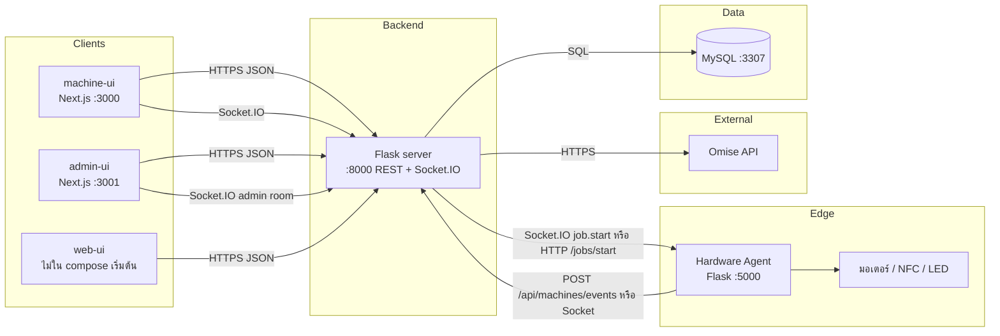

# Smart Vending Machine — เอกสารภาพรวมโปรเจกต์ (README2)

เอกสารนี้อธิบายโปรเจกต์ **Smart Vending Machine (Capstone)** แบบครบทุกส่วน รวมถึงวิธีรันในสถานการณ์ต่างๆ อ้างอิงจากโครงสร้างและไฟล์ config จริงใน repository ณ เวลาที่เขียน

> ไฟล์นี้เป็นเอกสารแยกจาก `README.md` และ `how-to-run.md` — ไม่แทนที่ไฟล์เดิม

---

## สารบัญ

1. [โปรเจกต์คืออะไร](#1-โปรเจกต์คืออะไร)
2. [สถาปัตยกรรมระบบ](#2-สถาปัตยกรรมระบบ)
3. [โครงสร้างโฟลเดอร์ทั้ง repo](#3-โครงสร้างโฟลเดอร์ทั้ง-repo)
4. [บริการ Docker Compose (รันแบบมาตรฐาน)](#4-บริการ-docker-compose-รันแบบมาตรฐาน)
5. [Backend — `server/` (Flask + Socket.IO)](#5-backend--server-flask--socketio)
6. [ฐานข้อมูล — `database/`](#6-ฐานข้อมูล--database)
7. [Hardware Agent — `client/agent/`](#7-hardware-agent--clientagent)
8. [Kiosk บน Raspberry Pi — `client/kiosk/`](#8-kiosk-บน-raspberry-pi--clientkiosk)
9. [Frontend ลูกค้าที่ตู้ — `web/machine-ui/`](#9-frontend-ลูกค้าที่ตู้--webmachine-ui)
10. [Frontend แอดมิน — `web/admin-ui/`](#10-frontend-แอดมิน--webadmin-ui)
11. [Frontend สมาชิก (มือถือ) — `web/web-ui/`](#11-frontend-สมาชิก-มือถือ--webweb-ui)
12. [API และเอกสาร OpenAPI](#12-api-และเอกสาร-openapi)
13. [แผนภาพและ sequence ใน `docs/diagrams/`](#13-แผนภาพและ-sequence-ใน-docsdiagrams)
14. [ตัวแปรสภาพแวดล้อม (Environment)](#14-ตัวแปรสภาพแวดล้อม-environment)
15. [ลำดับชีวิตคำสั่งซื้อและงานฮาร์ดแวร์](#15-ลำดับชีวิตคำสั่งซื้อและงานฮาร์ดแวร์)
16. [วิธีรันในสถานการณ์ต่างๆ](#16-วิธีรันในสถานการณ์ต่างๆ)
17. [การทดสอบการชำระเงินและฮาร์ดแวร์](#17-การทดสอบการชำระเงินและฮาร์ดแวร์)
18. [แก้ปัญหาเบื้องต้น](#18-แก้ปัญหาเบื้องต้น)
19. [ไฟล์อ้างอิงสำคัญ](#19-ไฟล์อ้างอิงสำคัญ)

---

## 1. โปรเจกต์คืออะไร

ระบบ **ตู้จำหน่ายอัจฉริยะ (Smart Vending)** สำหรับขายสินค้า (เช่น เปาหมูแดง/กุ้ง/เต้าหู้) ประกอบด้วย:

| บทบาท | เทคโนโลยี | หน้าที่หลัก |
|--------|-----------|-------------|
| หน้าจอลูกค้าที่ตู้ | Next.js 16 (`machine-ui`) | เลือกสินค้า, ตะกร้า, ชำระ Omise (บัตร / PromptPay), ติดตามสถานะ job ผ่าน Socket.IO |
| แดชบอร์ดแอดมิน | Next.js (`admin-ui`) | จัดการสินค้า, ตู้, สต็อกช่อง, ออเดอร์, คูปอง, ลูกค้า, แจ้งเตือน |
| แอปสมาชิก | Next.js (`web-ui`) | OTP login, แต้ม, แลกคูปอง, ประวัติ — **ไม่ได้อยู่ใน Docker Compose เริ่มต้น** แต่ API รองรับและ server mount build ได้ |
| API กลาง | Flask + eventlet + python-socketio | ธุรกิจ, Omise, MySQL, dispatch งานไป agent, realtime |
| ฐานข้อมูล | MySQL 8 | สินค้า, ตู้, สต็อก, ออเดอร์, events, admin RBAC |
| Agent ฮาร์ดแวร์ | Flask บน Raspberry Pi (หรือจำลองใน Docker) | มอเตอร์/LED/NFC, job state machine, ส่ง events กลับ server |
| ชำระเงิน | Omise | บัตรเครดิต, PromptPay (QR), webhook |

---

## 2. สถาปัตยกรรมระบบ

### 2.1 ภาพรวมการไหลของข้อมูล



### 2.2 โหมด dispatch งานไปตู้

| โหมด | ตัวแปร | พฤติกรรม |
|------|--------|----------|
| **socket** | (ค่าเริ่มต้น) | Server ส่ง event `job.start` ไปห้อง Socket.IO ของ `machine_code` — agent ที่ล็อกอินด้วย token รับงาน |

Health ของ agent ใช้ `AGENT_BASE_URL` (GET `/health`) — ไม่มี HTTP dispatch แยก

### 2.3 พอร์ตที่ publish บน host (Docker มาตรฐาน)

| บริการ | Host URL / Port | ภายใน container |
|--------|-----------------|-------------------|
| MySQL | `localhost:3307` | `:3306` |
| server (API + Socket.IO) | http://localhost:8000 | `:8000` |
| client (agent) | http://localhost:5000 | `:5000` |
| machine-ui | http://localhost:3000 | `:3000` |
| admin-ui | http://localhost:3001 | maps → container `:3000` |
| swagger-ui | http://localhost:8081 | `:8080` |
| Flasgger (บน server เดียวกัน) | http://localhost:8000/apidocs | — |

---

## 3. โครงสร้างโฟลเดอร์ทั้ง repo

```
Capstone-Project/
├── .env.example              # ตัวอย่าง env รวมศูนย์ (ใช้กับ docker compose)
├── docker-compose.yml        # สแต็กหลัก 6 บริการ + banner
├── swagger.yaml              # OpenAPI 2.0 — ใช้ Flasgger + swagger-ui container
├── README.md                 # ภาพรวมสั้น (ภาษาอังกฤษ)
├── how-to-run.md             # คู่มือ Docker + ลงทะเบียนตู้
├── README2.md                # เอกสารนี้
│
├── database/
│   └── init.sql              # schema + seed (รันครั้งแรกเมื่อ volume ใหม่)
│
├── server/                   # Flask backend
│   ├── main.py               # entry: eventlet + Socket.IO + background sweepers
│   ├── wsgi.py               # WSGI สำหรับ deploy อื่น
│   ├── Dockerfile
│   ├── requirements.txt
│   ├── migrations/           # Alembic / Flask-Migrate
│   └── app/
│       ├── factory.py        # สร้าง Flask app, blueprints, CORS, Swagger
│       ├── extensions.py     # SQLAlchemy, Migrate
│       ├── api/              # REST blueprints
│       ├── auth/             # JWT สมาชิก
│       ├── models/           # SQLAlchemy models
│       ├── services/         # Omise, buy, hardware, OTP, SMS, coupon
│       ├── realtime/         # socketio_gateway.py
│       └── db_config/        # pool mysql.connector + SQLAlchemy URI
│
├── client/
│   ├── agent/                # Hardware agent (Flask + Socket.IO client)
│   │   ├── agent.py          # entry
│   │   ├── routes.py         # /jobs/start, /dispense, SSE job stream
│   │   ├── ws_client.py      # เชื่อม server Socket.IO
│   │   ├── machine.py        # GPIO, LED, NFC, เสียง, mock job
│   │   ├── ws_outbox.py      # queue events เมื่อ offline
│   │   └── sounds/           # mp3 ตาม state งาน
│   └── kiosk/
│       ├── autostart.service # systemd ตัวอย่างบน Pi
│       └── chromium.sh       # เปิด machine-ui fullscreen
│
├── web/
│   ├── machine-ui/           # UI หน้าจอตู้ (Next.js 16)
│   ├── admin-ui/             # แดชบอร์ดแอดมิน
│   └── web-ui/               # แอปสมาชิก (OTP, แต้ม, redeem)
│
└── docs/diagrams/            # ไฟล์ .mmd (Mermaid) — sequence, state, use case
```

---

## 4. บริการ Docker Compose (รันแบบมาตรฐาน)

ไฟล์: `docker-compose.yml`

| Service | Container name | คำอธิบาย |
|---------|----------------|----------|
| `compose-banner` | vending-compose-banner | พิมพ์ตาราง URL ตอน start (Alpine one-shot) |
| `db` | vending-db | MySQL 8, volume `db_data`, mount `init.sql` |
| `server` | vending-server | Build `./server`, `env_file: .env`, healthcheck `/health` |
| `client` | vending-pi | Agent, `privileged`, mount `/dev/gpiomem`, volume `agent_data` |
| `machine-ui` | vending-machine-ui | Build args สำหรับ `NEXT_PUBLIC_*` |
| `admin-ui` | vending-admin-ui | Host 3001 → container 3000 |
| `swagger-ui` | vending-swagger-ui | แสดง `swagger.yaml` ที่พอร์ต 8081 |

**Volumes**

- `db_data` — ข้อมูล MySQL ถาวร; `init.sql` รันเฉพาะครั้งแรกที่ volume ว่าง
- `agent_data` — SQLite outbox ของ agent (`AGENT_DB_PATH=/data/agent.db`)

**ไม่รวมใน Compose:** `web-ui` (สมาชิก) — รันแยกด้วย `npm run dev` หรือ build แล้ว mount ไปที่ server ตาม volume `./web/web-ui/build:/app/web-build`

---

## 5. Backend — `server/` (Flask + Socket.IO)

### 5.1 การสตาร์ท

- `main.py` โหลด `.env`, monkey-patch **eventlet**, สร้าง `ServerApp`
- `create_app()` ใน `factory.py`: init DB pool, SQLAlchemy, CORS, Flasgger, blueprints
- `make_socketio_app()` ห่อ Flask เป็น WSGI + Socket.IO
- Background tasks (eventlet spawn):
  - ยกเลิกออเดอร์ `pending_payment` เกิน 15 นาที
  - suspend สมาชิกไม่ใช้งาน 1 ปี
  - ลบ `machine_job_events` เก่ากว่า 90 วัน (batch)

### 5.2 Blueprint / API สาธารณะ

| Prefix / Path | ไฟล์ | หน้าที่ |
|---------------|------|--------|
| `GET /health` | factory | `{ "status": "server-ok" }` |
| `GET /api/health` | health.py | health แบบละเอียด (ถ้ามี) |
| `GET /api/products?machine_code=` | products.py | รายการสินค้า + stock ตามตู้ |
| `POST /api/buy/*` | buy.py | checkout, draft, webhook, mock-pay, cancel, status |
| `POST /api/machines/events` | machine_events.py | agent ส่ง telemetry (HTTP sink) |
| `GET/POST /api/members/*` | members.py | สมาชิก, แต้ม |
| `POST /api/auth/otp/*` | auth_otp.py | ส่ง/ยืนยัน OTP → JWT |
| `GET /api/members/<phone>/orders` ฯลฯ | orders.py | ประวัติ, redeem, คูปอง |

**Buy endpoints หลัก** (`buy.py`):

- `POST /api/buy/checkout` — ชำระด้วย Omise token หรือ source (QR)
- `POST /api/buy/validate-coupon` — ตรวจคูปองก่อนจ่าย
- `POST /api/buy/create-draft` — สร้าง draft order
- `POST /api/buy/omise-webhook` — webhook Omise (HMAC ถ้ามี `OMISE_WEBHOOK_SECRET`)
- `POST /api/buy/mock-pay` — dev: บังคับ paid (ต้อง `ALLOW_MOCK_PAY=1`)
- `POST /api/buy/cancel` — ยกเลิก
- `GET /api/buy/status/<charge_id>` — polling สถานะ
- `POST /api/buy` — legacy buy path

### 5.3 Admin API — `/api/admin/*`

Blueprint: `app/api/admin/__init__.py` — auth ใช้ JWT (`Authorization: Bearer <token>`) ผ่าน `app/api/admin/decorators.py`

| Path | หน้าที่ |
|------|--------|
| `GET/POST /api/admin/machines` | รายการตู้, สร้างตู้ + `secret_token` แสดงครั้งเดียว |
| `GET/PUT /api/admin/machines/<code>` | รายละเอียด/แก้ตู้ |
| `PUT /api/admin/machines/<code>/slots` | จัดช่องสินค้า |
| `GET/POST/PUT/DELETE /api/admin/products` | CRUD สินค้า |
| `GET /api/admin/orders` | ออเดอร์ |
| `GET/POST /api/admin/coupons` | โปรโมชัน/คูปอง |
| `GET /api/admin/customers` | ลูกค้า |
| `GET /api/admin/dashboard/summary` | สรุปแดชบอร์ด |
| `GET /api/admin/reports/sales` | รายงานยอดขาย |
| `GET /api/admin/alerts` | แจ้งเตือนจาก machine_job_events |
| `GET /api/admin/users` | admin users |

### 5.4 Socket.IO (`realtime/socketio_gateway.py`)

| ผู้เชื่อม | Auth | Room / เหตุการณ์ |
|----------|------|------------------|
| **Machine (agent)** | `{ "machine_code": "<code>", "token": "<plaintext>" }` | bcrypt กับ `machines.secret_token_hash`; อัปเดต `is_online`; รับ `job.start` |
| **Admin UI** | `{ "role": "admin" }` หรือ `{ "admin_token": "..." }` ถ้ามี `ADMIN_SOCKET_SECRET` | room `admin`, event `dashboard_update` |
| **machine-ui (browser)** | ตาม implementation ใน `useJobSocket.ts` | ติดตาม job ของ `NEXT_PUBLIC_MACHINE_CODE` |

เมื่อชำระสำเร็จ server จะ dispatch งานผ่าน Socket.IO (`job.start`) และ agent รัน state machine: `TRANSFER_TO_OVEN` → `HEATING` → `DISPENSING` → `DONE` / `ERROR`

### 5.5 Services ชั้นธุรกิจ

| โมดูล | บทบาท |
|--------|--------|
| `omise_service.py` | สร้าง charge, จัดการ source QR |
| `buy_service.py` | สต็อก, สร้าง order, claim หลังจ่าย |
| `hardware_service.py` | ping `/health` ของ agent (dispatch ใช้ Socket.IO `job.start` เท่านั้น) |
| `coupon_service.py` | ตรวจ/คำนวณส่วนลด |
| `otp_service.py` + `sms_service.py` | OTP สมาชิก (console log ใน dev) |

### 5.6 Migrations

- `server/migrations/` — Alembic ผ่าน Flask-Migrate
- `init.sql` สำหรับ Docker ครั้งแรก; migration เพิ่มเติมสำหรับ schema หลัง deploy (เช่น `secret_token_hash`, `is_online`, `max_uses`)

---

## 6. ฐานข้อมูล — `database/`

### 6.1 ตารางหลัก

| ตาราง | ความหมาย |
|--------|----------|
| `users` | สมาชิก (เบอร์โทร, แต้ม, status) |
| `otp_sessions` | OTP login |
| `promotions` / `user_promotions` | คูปองและการแลก |
| `machines` | ตู้ (`machine_code` PK, `secret_token_hash`, `is_online`) |
| `products` | สินค้า (ราคา, `heating_time`, category) |
| `machine_slots` | สต็อกต่อช่องต่อตู้ |
| `orders` / `order_items` | คำสั่งซื้อ + สถานะชำระ/จ่ายของ |
| `machine_job_events` | telemetry จาก agent (seq, state, JSON) |
| `admin_users` / `roles` / `admin_user_role` | RBAC แอดมิน |
| `transactions` | บันทึก Omise ต่อ order |

### 6.2 Seed เริ่มต้น (`init.sql`)

- ตู้ **`MP1-001`** ที่ KMUTT — **ไม่มี** `secret_token_hash` (ใช้ Socket auth ต้องสร้างตู้ใหม่หรืออัปเดต DB)
- สินค้า 6 รายการ (เปาหมูแดง, หมูสับ, กุ้ง, เต้าหู้, เห็ด, ครีม)
- ช่อง 1–6 ตู้ `MP1-001` สต็อก 20 ชิ้นต่อช่อง
- โปรโมชัน `POINTS50`, `POINTS100`
- สมาชิก demo เบอร์ `0631723422` แต้ม 150

---

## 7. Hardware Agent — `client/agent/`

### 7.1 บทบาท

รันบน **Raspberry Pi** จริง หรือใน Docker เป็น **จำลอง Pi** (`vending-pi`):

- Flask API พอร์ต 5000 (`routes.py`)
- Socket.IO client ไป server (`ws_client.py`) — ต้องมี `MACHINE_CODE` + `MACHINE_TOKEN`
- `machine.py` — GPIO LED, NFC MFRC522, เสียง VLC, mock job เมื่อไม่มีฮาร์ดแวร์

### 7.2 HTTP endpoints สำคัญ (agent)

- `POST /jobs/start` — เริ่มงานจ่ายของ (server เรียกในโหมด http หรือ agent รับจาก socket)
- (deprecated) `POST /dispense` — legacy (ปัจจุบัน dispatch ใช้ Socket.IO `job.start`)
- SSE/stream ติดตาม job state (ภายใน `routes.py`)

### 7.3 Environment สำคัญ (agent)

ดู `client/agent/.env.example`: `MACHINE_CODE`, `MACHINE_TOKEN`, `SERVER_SOCKET_URL`, `NFC_AUTO_APPROVE`, pin LED, `MACHINE_UI_URL` สำหรับ Chromium บน Pi

### 7.4 Docker vs Pi จริง

| สถานการณ์ | หมายเหตุ |
|-----------|----------|
| Docker `client` | `SERVER_SOCKET_URL=http://server:8000`, GPIO อาจไม่มี — ใช้ mock |
| Pi จริง | ตั้ง IP LAN ใน `.env`, `privileged` + `/dev/gpiomem`, systemd `autostart.service` |

---

## 8. Kiosk บน Raspberry Pi — `client/kiosk/`

- `chromium.sh` — เปิด URL ของ `machine-ui` แบบ fullscreen
- `autostart.service` — ตัวอย่าง systemd ให้ agent + UI ขึ้นหลัง boot

Workflow บน Pi โดยทั่วไป:

1. รัน MySQL + server บนเซิร์ฟเวอร์/LAN หรือ Pi ที่แรงพอ
2. รัน `machine-ui` ให้ browser ใน Pi เข้าถึงได้ (`MACHINE_UI_URL`)
3. รัน `agent.py` ด้วย token จาก Admin

---

## 9. Frontend ลูกค้าที่ตู้ — `web/machine-ui/`

### 9.1 เทคโนโลยี

- Next.js **16.2.4**, React 19, Tailwind 4, `socket.io-client`
- โค้ดหลัก: `src/app/page.tsx`, components ใน `src/components/`, `src/hooks/useJobSocket.ts`

### 9.2 Build-time env (สำคัญ)

Next.js ฝัง **`NEXT_PUBLIC_*` ตอน build** เท่านั้น — เปลี่ยนใน `.env` แล้วต้อง **rebuild image**:

| ตัวแปร | ความหมาย |
|--------|----------|
| `NEXT_PUBLIC_OMISE_PUBLIC_KEY` | Omise public key |
| `NEXT_PUBLIC_API_URL` | URL Flask ที่ browser เรียก (มัก `http://localhost:8000`) |
| `NEXT_PUBLIC_MACHINE_CODE` | รหัสตู้สำหรับ API + Socket room |
| `NEXT_PUBLIC_SERVER_SOCKET_URL` | Socket.IO (มักเท่า API URL) |
| `NEXT_PUBLIC_AGENT_BASE_URL` | ถ้าต้องเรียก agent โดยตรงจาก browser (ไม่บ่อย) |

### 9.3 ฟีเจอร์หลักบน UI

- แสดงสินค้าจาก `GET /api/products?machine_code=`
- ตะกร้า, คูปอง, ชำระ Omise (ปุ่มทดสอบ Visa test ใน dev)
- Realtime job ผ่าน Socket.IO

---

## 10. Frontend แอดมิน — `web/admin-ui/`

### 10.1 หน้าแอป (`app/`)

| Route | หน้าที่ |
|-------|--------|
| `/login`, `/register` | auth UI |
| `/` | แดชบอร์ด |
| `/products` | สินค้า |
| `/machines`, `/machines/[id]` | ตู้ + ช่อง |
| `/orders` | ออเดอร์ |
| `/customers`, `/coupons` | ลูกค้า / คูปอง |
| `/alerts` | แจ้งเตือน (API จริงจาก Flask; บาง route ยัง mock ใน Next) |
| `/sales`, `/reports` | รายงาน |
| `/settings`, `/security`, `/profile` | ตั้งค่า |

### 10.2 การเชื่อม API

- `NEXT_PUBLIC_ADMIN_API_URL` หรือ `NEXT_PUBLIC_API_URL` — URL ที่ **browser** เรียกได้ (ไม่ใช่ hostname `server` ภายใน Docker)
- Docker: host **3001** → container 3000
- Dev แยก: `npx next dev -p 3001` เพื่อไม่ชน machine-ui ที่ 3000

### 10.3 Mock vs จริง

ยังใช้ Next route handlers mock สำหรับ: `/api/dashboard`, `/api/alerts`, `/api/sales` — ส่วน products, machines, orders, coupons, customers ดึงจาก Flask `/api/admin/*`

---

## 11. Frontend สมาชิก (มือถือ) — `web/web-ui/`

### 11.1 หน้าแอป

| Route | หน้าที่ |
|-------|--------|
| `(auth)/login` | OTP login |
| `(main)/home` | หน้าหลัก |
| `(main)/checkout`, `(main)/payment` | สั่งซื้อ/ชำระ |
| `(main)/history` | ประวัติ |
| `(main)/redeem`, `(main)/coupons` | แลกคูปอง |
| `(main)/profile`, `(main)/help` | โปรไฟล์ / ช่วยเหลือ |

### 11.2 การรัน

**ไม่มี service ใน `docker-compose.yml`** — รัน local:

```bash
cd web/web-ui
npm install
# ตั้ง .env.local ให้ชี้ NEXT_PUBLIC_API_URL ไป server
npm run dev
```

Server สามารถ serve static build ผ่าน mount `web/web-ui/build` → `/` และ `/static/*` (ดู `factory.py`)

---

## 12. API และเอกสาร OpenAPI

| แหล่ง | URL |
|-------|-----|
| Flasgger (live บน server) | http://localhost:8000/apidocs |
| Swagger UI container | http://localhost:8081 (ไฟล์ `swagger.yaml`) |
| ไฟล์ต้นฉบับ | `swagger.yaml` ที่ root |

---

## 13. แผนภาพและ sequence ใน `docs/diagrams/`

รายการใน `docs/diagrams/FILES.txt` — เปิดด้วย [Mermaid Live](https://mermaid.live) หรือ extension VS Code

| กลุ่ม | ไฟล์ตัวอย่าง |
|------|----------------|
| Use case | `usecase.mmd` |
| Class | `class-domain-models.mmd`, `class-application-layer.mmd` |
| State | `state-order-lifecycle.mmd`, `state-hardware-job-event.mmd` |
| Sequence | `sequence-03-checkout-card`, `sequence-04-checkout-qr-webhook`, `sequence-11-socketio-connect`, `sequence-13-admin-api-surface` |
| Context | `context-architecture.mmd` |

ใช้ประกอบการอ่าน flow ชำระเงิน / จ่ายของ / admin โดยไม่ต้องไล่โค้ดทีละไฟล์

---

## 14. ตัวแปรสภาพแวดล้อม (Environment)

ไฟล์แม่: **`.env` ที่ root** (คัดลอกจาก `.env.example`) — Compose อ่าน `${VAR}` และ `env_file` ของ server

### 14.1 กลุ่มตัวแปร

| กลุ่ม | ตัวแปรหลัก | ใช้โดย |
|-------|------------|--------|
| Database | `DB_HOST`, `DB_USER`, `DB_PASSWORD`, `DB_NAME` | server (ใน Docker `DB_HOST=db`) |
| Omise | `NEXT_PUBLIC_OMISE_PUBLIC_KEY`, `OMISE_SECRET_KEY` | machine-ui build, server |
| API URLs | `NEXT_PUBLIC_API_URL`, `NEXT_PUBLIC_ADMIN_API_URL`, `RETURN_URI` | frontends, redirect 3DS |
| Machine identity | `MACHINE_CODE`, `MACHINE_TOKEN`, `NEXT_PUBLIC_MACHINE_CODE` | agent, machine-ui build |
| Socket | `SERVER_SOCKET_URL`, `NEXT_PUBLIC_SERVER_SOCKET_URL` | agent ภายใน Docker = `http://server:8000`; browser = `http://localhost:8000` |
| Agent health | `AGENT_BASE_URL` | server → GET `/health` |
| Auth สมาชิก | `JWT_SECRET`, `AUTH_DEV_BYPASS`, `OTP_TTL_SECONDS` | OTP (console) / JWT |
| Dev | `ALLOW_MOCK_PAY`, `ADMIN_SOCKET_SECRET` | mock-pay, admin socket |
| CORS | `CORS_ORIGINS` | server — เพิ่ม origin LAN เมื่อเข้าจาก IP |

### 14.2 ค่าเริ่มต้นที่มักสับสน

- **`MP1-001`**: seed มีตู้และสต็อก แต่ **ไม่มี token** → agent Socket auth ล้มเหลวจนกว่าจะสร้างตู้ใหม่ใน Admin หรือตั้ง `MACHINE_TOKEN` ของตู้ที่มี hash แล้ว
- **`NEXT_PUBLIC_MACHINE_CODE`**: ต้อง rebuild `machine-ui` หลังเปลี่ยน
- **`MACHINE_TOKEN`**: ใส่ใน root `.env` สำหรับ service `client` — ไม่ใช่แค่ `client/agent/.env` ใน Docker

---

## 15. ลำดับชีวิตคำสั่งซื้อและงานฮาร์ดแวร์

### 15.1 สถานะ order (`orders.status`)

`pending_payment` → `paid` → `dispensing` → `completed`  
หรือ `cancelled`, `payment_failed`, `dispense_failed`, `refunded`

(รายละเอียดเต็ม: `docs/diagrams/state-order-lifecycle.mmd`)

### 15.2 Job ฮาร์ดแวร์

`TRANSFER_TO_OVEN` → `HEATING` → `DISPENSING` → `DONE` / `ERROR`  
Events บันทึกใน `machine_job_events` และส่งกลับ server

### 15.3 Flow ชำระเงินแบบย่อ

1. machine-ui โหลดสินค้า + สร้าง draft/checkout
2. Omise tokenize (บัตร) หรือสร้าง source QR (PromptPay)
3. server สร้าง charge, อัปเดต order
4. Webhook หรือ polling หรือ `mock-pay` → `paid`
5. server `emit_job_start` (socket) หรือ HTTP ไป agent
6. agent จ่ายของ, ส่ง events → admin dashboard realtime

---

## 16. วิธีรันในสถานการณ์ต่างๆ

### 16.1 สถานการณ์ A — รันทั้งสแต็กด้วย Docker (แนะนำครั้งแรก)

**ขั้นตอน**

```bash
# ที่ root โปรเจกต์
copy .env.example .env    # Windows
# แก้ NEXT_PUBLIC_OMISE_PUBLIC_KEY และ OMISE_SECRET_KEY

docker compose up --build
```

**ตรวจสอบ**

- http://localhost:8000/health
- http://localhost:3000 (machine-ui)
- http://localhost:3001 (admin-ui)
- `docker logs -f vending-pi` (agent)

**Detached**

```bash
docker compose up --build -d
```

**Log ละเอียด (ไม่มี prefix รวม)**

```bash
docker compose up --build --no-log-prefix
```

---

### 16.2 สถานการณ์ B — ลงทะเบียนตู้ใหม่และให้ agent + UI ตรงกัน

1. เปิด Admin http://localhost:3001 → Machines → สร้างตู้ เช่น `DEMO-01`
2. คัดลอก `machine_code` และ **`secret_token` (ครั้งเดียว)**
3. ใน root `.env`:

```env
MACHINE_CODE=DEMO-01
MACHINE_TOKEN=<secret_token>
NEXT_PUBLIC_MACHINE_CODE=DEMO-01
```

4. รีสตาร์ท agent:

```bash
docker compose up -d --build client
```

5. Rebuild machine-ui (เพราะ `NEXT_PUBLIC_MACHINE_CODE`):

```bash
docker compose build --no-cache machine-ui
docker compose up -d machine-ui
```

6. ใน Admin เพิ่ม **machine slots** ให้ `DEMO-01` (ตู้ seed `MP1-001` มีสต็อกแล้ว ตู้ใหม่ยังไม่มี)

---

### 16.3 สถานการณ์ C — รีเซ็ตฐานข้อมูลทั้งหมด

```bash
docker compose down -v
docker compose up --build
```

`-v` ลบ volume `db_data` — `init.sql` รันใหม่, ข้อมูลตู้/ออเดอร์หาย

---

### 16.4 สถานการณ์ D — รันเฉพาะบาง service

```bash
docker compose up -d db server
docker compose up -d machine-ui admin-ui
docker compose up -d --build client
```

แก้ Omise หรือ API URL ของ frontend → rebuild image ที่เกี่ยวข้อง

---

### 16.5 สถานการณ์ E — พัฒนา Backend แบบ local (ไม่ใช้ Docker สำหรับ server)

**สมมติ MySQL รันที่ localhost:3307** (จาก Docker `db` อย่างเดียว):

```bash
docker compose up -d db
```

ที่ `server/`:

```bash
python -m venv .venv
.venv\Scripts\activate          # Windows
pip install -r requirements.txt
```

ตั้ง `.env` (หรือ export):

```env
DB_HOST=127.0.0.1
DB_PORT=3307
DB_USER=root
DB_PASSWORD=root
DB_NAME=vending
OMISE_SECRET_KEY=...
SOCKETIO_ENABLED=1
```

```bash
cd server
python main.py
```

API: http://localhost:8000

**Migration (ถ้าต้องการ schema ล่าสุดนอก init.sql)**

```bash
cd server
flask db upgrade   # ตามที่โปรเจกต์ตั้ง Flask-Migrate CLI
```

---

### 16.6 สถานการณ์ F — พัฒนา machine-ui แบบ hot reload

```bash
docker compose up -d db server
cd web/machine-ui
npm install
```

สร้าง `.env.local` (ดู `.env.example`):

```env
NEXT_PUBLIC_API_URL=http://localhost:8000
NEXT_PUBLIC_SERVER_SOCKET_URL=http://localhost:8000
NEXT_PUBLIC_OMISE_PUBLIC_KEY=pkey_test_...
NEXT_PUBLIC_MACHINE_CODE=MP1-001
```

```bash
npm run dev
```

เปิด http://localhost:3000 — **ไม่ต้อง rebuild Docker** ขณะแก้ UI

---

### 16.7 สถานการณ์ G — พัฒนา admin-ui แบบ hot reload

```bash
docker compose up -d db server
cd web/admin-ui
npm install
```

`.env.local`:

```env
NEXT_PUBLIC_ADMIN_API_URL=http://localhost:8000
```

```bash
npx next dev -p 3001
```

CORS ใน compose รวม `http://localhost:3001` อยู่แล้ว

---

### 16.8 สถานการณ์ H — พัฒนา web-ui (สมาชิก)

```bash
docker compose up -d db server
cd web/web-ui
npm install
npm run dev
```

ตั้ง API URL ชี้ `http://localhost:8000`  
ทดสอบ OTP: รหัส OTP โผล่ที่ console ของ server; `AUTH_DEV_BYPASS=1` รับ OTP 6 หลักใดๆ (dev เท่านั้น)

---

### 16.9 สถานการณ์ I — Agent บน Raspberry Pi (LAN)

1. Server รันที่ IP เช่น `192.168.1.44:8000` (Docker หรือ bare metal)
2. บน Pi: `client/agent/.env` จาก `.env.example`

```env
MACHINE_CODE=DEMO-01
MACHINE_TOKEN=<จาก Admin>
SERVER_SOCKET_URL=http://192.168.1.44:8000
MACHINE_UI_URL=http://192.168.1.44:3000
NFC_AUTO_APPROVE=false
```

3. บน **server** root `.env` / compose override:

```env
CORS_ORIGINS=http://localhost:3000,http://192.168.1.44:3000,...
```

4. `pip install -r requirements.txt` แล้ว `python agent.py`
5. ติดตั้ง systemd จาก `client/kiosk/autostart.service` (แก้ path ให้ตรง Pi)

**machine-ui บน LAN:** build ด้วย `NEXT_PUBLIC_API_URL=http://<server-ip>:8000` แล้ว deploy หรือรัน Next บน Pi/เครื่องที่ browser เข้าถึง API ได้

---

### 16.10 สถานการณ์ J — ทดสอบ agent อย่างเดียว (HTTP job)

```bash
curl -X POST http://localhost:5000/jobs/start \
  -H "Content-Type: application/json" \
  -d "{\"machine_code\": \"MP1-001\", \"items\": [{\"product_id\": 1, \"quantity\": 1}]}"
```

ดู log `vending-pi` ว่า state เปลี่ยน

---

### 16.11 สถานการณ์ K — พอร์ตชนกับโปรแกรมอื่น

แก้ mapping ซ้ายใน `docker-compose.yml` เช่น `"8001:8000"` แล้วอัปเดต `.env`:

```env
NEXT_PUBLIC_API_URL=http://localhost:8001
```

Rebuild frontend ที่ bake URL

---

### 16.12 สถานการณ์ L — ดู MySQL จากเครื่อง host

- Host: `127.0.0.1`
- Port: `3307`
- User/Pass: `root` / `root` (ตาม compose)
- Database: `vending`

---

## 17. การทดสอบการชำระเงินและฮาร์ดแวร์

### 17.1 Omise Test

1. ใส่ keys จาก [Omise Dashboard](https://dashboard.omise.co/) ใน `.env`
2. machine-ui: ปุ่ม **[Test] Simulate Visa Tap** (บัตรทดสอบ 4242...)
3. PromptPay: แสดง QR → จำลองด้วย webhook ไป `/api/buy/omise-webhook` หรือ dev:

```bash
curl -X POST http://localhost:8000/api/buy/mock-pay \
  -H "Content-Type: application/json" \
  -d "{\"charge_id\": \"<charge_id>\"}"
```

(ต้อง `ALLOW_MOCK_PAY=1`)

### 17.2 ตรวจว่าจ่ายของทำงาน

- agent มี `MACHINE_CODE` + `MACHINE_TOKEN` ถูกต้อง และเชื่อม Socket.IO ได้
- Log `vending-pi`: `[Dispense]` / state transitions
- Admin alerts / `machine_job_events` มีแถวใหม่

### 17.3 NFC บน Pi

- `NFC_AUTO_APPROVE=true` — จำลองอนุมัติทันที
- `false` — รออ่าน tag MFRC522 จริง

---

## 18. แก้ปัญหาเบื้องต้น

| อาการ | สาเหตุที่พบบ่อย | แนวทาง |
|--------|-----------------|--------|
| Agent `Authentication failed` | ไม่มี token / ผิดตู้ / `MP1-001` ไม่มี hash | สร้างตู้ใหม่ใน Admin หรือตั้ง `MACHINE_CODE` + `MACHINE_TOKEN` |
| Agent ไม่ retry หลัง auth fail | ออกแบบใน `ws_client.py` | แก้ token แล้ว restart container |
| machine-ui ผิดตู้ / ไม่ได้รับ socket | `NEXT_PUBLIC_MACHINE_CODE` เก่าใน image | rebuild `machine-ui` |
| สต็อกว่างหลังสร้างตู้ใหม่ | seed มีแค่ `MP1-001` | Admin → ใส่ slots |
| แก้ `init.sql` แล้ว DB ไม่เปลี่ยน | volume เก่า | `docker compose down -v` |
| CORS จาก IP LAN | origin ไม่ใน list | เพิ่มใน `CORS_ORIGINS` แล้ว restart server |
| Build machine-ui ล้ม | ไม่มี Omise public key | ใส่ใน `.env` ก่อน build |
| Admin สร้าง machine ไม่ได้ | duplicate `machine_code` | ใช้รหัสใหม่ |
| Port ถูกใช้แล้ว | Jenkins 8080 ฯลฯ | swagger ใช้ 8081 แล้ว; แก้ mapping อื่นตามต้องการ |

---

## 19. ไฟล์อ้างอิงสำคัญ

| ไฟล์ | เนื้อหา |
|------|---------|
| `docker-compose.yml` | บริการ, พอร์ต, build args, healthcheck |
| `.env.example` | รายการตัวแปรครบ + คอมเมนต์ |
| `database/init.sql` | Schema + seed |
| `swagger.yaml` | สัญญา API + คำอธิบาย Socket.IO |
| `server/app/realtime/socketio_gateway.py` | Auth ตู้ + admin + job dispatch |
| `server/app/api/buy.py` | ชำระเงิน |
| `client/agent/ws_client.py` | Agent Socket.IO |
| `client/agent/routes.py` | Job manager HTTP |
| `web/machine-ui/Dockerfile` | Build-time `NEXT_PUBLIC_*` |
| `how-to-run.md` | คู่มือ Docker + ลงทะเบียนตู้ (ภาษาอังกฤษ) |
| `README.md` | ภาพรวมสั้น + badges |

---

## สรุปสั้น

โปรเจกต์นี้คือ **สแต็กตู้จำหน่ายอัจฉริยะ** ที่แยกชั้น UI (ตู้ / แอดมิน / สมาชิก), API กลาง (Flask + Socket.IO + Omise), MySQL และ agent ฮาร์ดแวร์บน Pi วิธีรันที่ตรงกับ repo มากที่สุดคือ **`docker compose up --build` ที่ root พร้อม `.env`** จากนั้นสร้างตู้ใน Admin แล้ว sync `MACHINE_CODE`, `MACHINE_TOKEN`, และ rebuild `machine-ui` เมื่อเปลี่ยน `NEXT_PUBLIC_MACHINE_CODE` สำหรับพัฒนาแยกส่วน ใช้ MySQL จาก container `db` แล้วรัน `python main.py` / `npm run dev` ตามโฟลเดอร์ในหัวข้อ 16.5–16.8

---

*เอกสารนี้สร้างเป็น `README2.md` ตามคำขอ — ไม่ได้แก้ไขไฟล์อื่นใน repository*
