# Vending Machine (MOD PAO) Database ER Diagram

นี่คือแผนภาพโครงสร้างความสัมพันธ์ของฐานข้อมูล (Entity Relationship Diagram - ERD) สำหรับโปรเจกต์ตู้ขายของอัจฉริยะ MOD PAO โดยใช้รูปแบบ **Mermaid**

## Mermaid ER Diagram

```mermaid
erDiagram
    %% =========================================================================
    %% 1. USER & LOYALTY MODULE (ระบบสมาชิก คะแนน และโปรโมชัน)
    %% =========================================================================
    USERS {
        int user_id PK "AUTO_INCREMENT"
        varchar phone_number "Unique เบอร์มือถือ"
        varchar display_name "ชื่อผู้ใช้"
        int points "คะแนนสะสม"
        datetime registered_at "วันเวลาสมัคร"
        datetime last_use "การใช้งานล่าสุด"
        enum status "active suspended banned"
    }

    OTP_SESSIONS {
        bigint id PK "AUTO_INCREMENT"
        varchar phone_number "เบอร์รับ OTP"
        varchar code_hash "แฮชรหัส OTP"
        datetime expires_at "หมดอายุ"
        datetime verified_at "ยืนยันแล้ว"
        datetime created_at "สร้างเซสชัน"
    }

    PROMOTIONS {
        int promotion_id PK "AUTO_INCREMENT"
        varchar code "Unique รหัสคูปอง"
        enum type "fixed_amount percent"
        decimal discount_amount "ยอดส่วนลด"
        boolean is_active "เปิดใช้งาน"
        datetime expire_date "วันหมดอายุ"
        int points_cost "คะแนนใช้แลก"
        int max_uses "สิทธิ์รวมสูงสุด"
    }

    USER_PROMOTIONS {
        int id PK "AUTO_INCREMENT"
        int user_id FK "USERS"
        int promotion_id FK "PROMOTIONS"
        enum status "active used expired"
        datetime redeemed_at "วันเวลาที่แลก"
    }

    %% =========================================================================
    %% 2. PRODUCT & VENDING SYSTEM MODULE (ระบบตู้น้ำ คลังสินค้า และสินค้า)
    %% =========================================================================
    MACHINES {
        varchar machine_code PK "รหัสตู้"
        text location "สถานที่ตั้ง"
        enum status "online maintenance offline"
        datetime last_active "อัปเดตสถานะ"
        varchar secret_token_hash "แฮชโทเค็นความปลอดภัย"
        tinyint is_online "ออนไลน์อยู่หรือไม่ 0-1"
    }

    PRODUCTS {
        int product_id PK "AUTO_INCREMENT"
        varchar name "ชื่อสินค้า"
        varchar description "รายละเอียด"
        decimal price "ราคา"
        varchar image_url "ลิงก์รูปสินค้า"
        int heating_time "วินาทีอุ่นร้อน"
        enum category "meat vegetarian sweet"
    }

    MACHINE_SLOTS {
        int id PK "AUTO_INCREMENT"
        varchar machine_code FK "MACHINES"
        int slot_number "ช่องสินค้าที่"
        int product_id FK "PRODUCTS"
        int quantity "จำนวนในตู้"
    }

    %% =========================================================================
    %% 3. ORDER & TRANSACTIONAL MODULE (ระบบสั่งซื้อ การจ่ายเงิน และเหตุการณ์จ่ายของ)
    %% =========================================================================
    ORDERS {
        int order_id PK "AUTO_INCREMENT"
        varchar machine_code FK "MACHINES"
        int user_id FK "USERS (Nullable)"
        int promotion_id FK "PROMOTIONS (Nullable)"
        varchar charge_id "Unique รหัส Omise"
        decimal total_price "ยอดจ่ายจริง"
        enum payment_method "cash qr_code credit_card"
        enum status "สถานะสั่งซื้อ"
        datetime created_at "เริ่มสั่งซื้อ"
        datetime updated_at "อัปเดตสั่งซื้อ"
    }

    ORDER_ITEMS {
        int id PK "AUTO_INCREMENT"
        int order_id FK "ORDERS"
        int product_id FK "PRODUCTS"
        int quantity "จำนวนที่ซื้อ"
        decimal price_at_purchase "ราคา ณ ตอนซื้อ"
    }

    TRANSACTIONS {
        int id PK "AUTO_INCREMENT"
        int order_id FK "ORDERS"
        varchar provider "ผู้ให้บริการชำระเงิน"
        varchar provider_ref "รหัสธุรกรรมนอก"
        decimal amount "ยอดชำระ"
        varchar currency "สกุลเงิน THB"
        decimal fee_amount "ค่าธรรมเนียม"
        varchar status "สถานะรายการเงิน"
        json raw_payload_json "ข้อมูลดิบจากผู้ให้บริการ"
        datetime created_at "เวลาทำรายการ"
    }

    MACHINE_JOB_EVENTS {
        bigint id PK "AUTO_INCREMENT"
        varchar machine_code FK "MACHINES"
        varchar job_id "ไอดีจ่ายของ"
        varchar order_charge_id "รหัส Omise"
        varchar event_type "ประเภทเหตุการณ์"
        varchar state "สถานะปัจจุบัน"
        int seq "ลำดับการทำงาน"
        json payload_json "ข้อมูลดิบส่งเข้าตู้"
        datetime created_at "เวลาสร้างงาน"
        boolean is_resolved "แก้ไขแล้ว"
        datetime resolved_at "เวลาที่แก้ไข"
    }

    %% =========================================================================
    %% 4. ADMIN PRIVILEGE MODULE (ระบบผู้ดูแลระบบและสิทธิ์การใช้งาน)
    %% =========================================================================
    ADMIN_USERS {
        int id PK "AUTO_INCREMENT"
        varchar email "Unique อีเมลแอดมิน"
        varchar password_hash "แฮชรหัสผ่าน"
        boolean is_active "เปิดใช้งานอยู่"
        datetime created_at "สร้างระบบ"
        datetime updated_at "อัปเดตข้อมูล"
    }

    ROLES {
        int id PK "AUTO_INCREMENT"
        varchar name "Unique ชื่อสิทธิ์"
        varchar description "อธิบายสิทธิ์"
    }

    ADMIN_USER_ROLE {
        int admin_user_id PK "PK, FK -> ADMIN_USERS"
        int role_id PK "PK, FK -> ROLES"
    }

    %% =========================================================================
    %% RELATIONSHIPS (การเรียงลำดับเส้นเชื่อมต่อเพื่อให้แสดงผลได้สวยงามและอ่านง่ายที่สุด)
    %% =========================================================================
    
    %% --- สมาชิก คูปอง และโปรโมชัน ---
    USERS ||--o{ USER_PROMOTIONS : "owns"
    PROMOTIONS ||--o{ USER_PROMOTIONS : "redeemed_in"
    
    %% --- การเติมของในตู้หยอดเหรียญ ---
    MACHINES ||--o{ MACHINE_SLOTS : "contains"
    PRODUCTS ||--o{ MACHINE_SLOTS : "stocked_in"
    
    %% --- รายการสั่งซื้อหลัก ---
    USERS ||--o{ ORDERS : "placed"
    MACHINES ||--o{ ORDERS : "processed_at"
    PROMOTIONS ||--o{ ORDERS : "applied_to"
    
    %% --- ข้อมูลย่อยของออเดอร์และการชำระเงิน ---
    ORDERS ||--|{ ORDER_ITEMS : "contains"
    PRODUCTS ||--o{ ORDER_ITEMS : "ordered_in"
    ORDERS ||--o{ TRANSACTIONS : "bills"
    
    %% --- การจ่ายงานให้ตู้และผู้ดูแล ---
    MACHINES ||--o{ MACHINE_JOB_EVENTS : "executes"
    ADMIN_USERS ||--o{ ADMIN_USER_ROLE : "has"
    ROLES ||--o{ ADMIN_USER_ROLE : "grants"
```

## คำอธิบายความสัมพันธ์ที่สำคัญ (Key Relationships)

1. **Member & Loyalty System (ระบบสมาชิกและคะแนนสะสม)**
   - `users` เก็บข้อมูลผู้ใช้และคะแนนสะสม (`points`)
   - `users` สามารถแลกคูปองใน `promotions` มาเก็บไว้ใน `user_promotions` ได้แบบ 1-to-Many
   - ตาราง `otp_sessions` ใช้สำหรับการยืนยันตัวตนแบบไร้รหัสผ่าน (Passwordless Login) ด้วยเบอร์มือถือ

2. **Vending Machine & Stock System (ระบบตู้หยอดเหรียญและสินค้า)**
   - `machines` (ตู้) จะมีความสัมพันธ์แบบ 1-to-Many กับ `machine_slots` (ช่องจ่ายสินค้าของตู้)
   - สินค้าในตาราง `products` จะนำไปจับคู่กับตู้และช่องจ่ายสินค้าผ่านตาราง `machine_slots`

3. **Ordering & Payment System (ระบบสั่งซื้อและชำระเงิน)**
   - `orders` (รายการสั่งซื้อ) จะผูกเข้ากับ `machines` ว่าสั่งจากตู้ไหน, ผูกกับ `users` (ถ้าเป็นสมาชิกที่ล็อกอิน), และผูกกับ `promotions` (ถ้าใช้คูปองส่วนลด)
   - 1 ออเดอร์ใน `orders` สามารถประกอบด้วยสินค้าหลายชิ้นใน `order_items` (1-to-Many)
   - ตาราง `transactions` ใช้สำหรับบันทึกผลการทำธุรกรรมทางการเงินและค่าธรรมเนียมผ่าน Gateway (เช่น Omise) ร่วมกับ `orders`

4. **Hardware Communication (ระบบประสานงานตู้หยอดเหรียญ)**
   - ตาราง `machine_job_events` เก็บสถานะและบันทึกคิวการทำงาน (Job Queue Events) การจ่ายของและอุ่นร้อนที่ตู้ (`machines`) ส่งกลับมา เพื่อรองรับระบบแบบ Event-Driven ให้ตู้กับ Server ทำงานสอดประสานกันได้อย่างแม่นยำ

5. **Admin Access Control (ระบบจัดการสิทธิ์ผู้ดูแลระบบ)**
   - ตาราง `admin_users` และ `roles` มีความสัมพันธ์แบบ Many-to-Many ผ่านตารางตรงกลาง `admin_user_role` เพื่อควบคุมสิทธิ์ในการจัดการตู้หลังบ้าน (เช่น การเติมของ, การดูยอดขาย)
