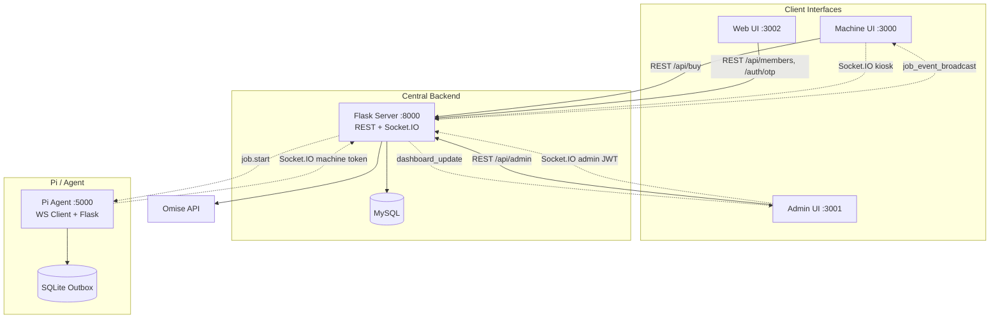
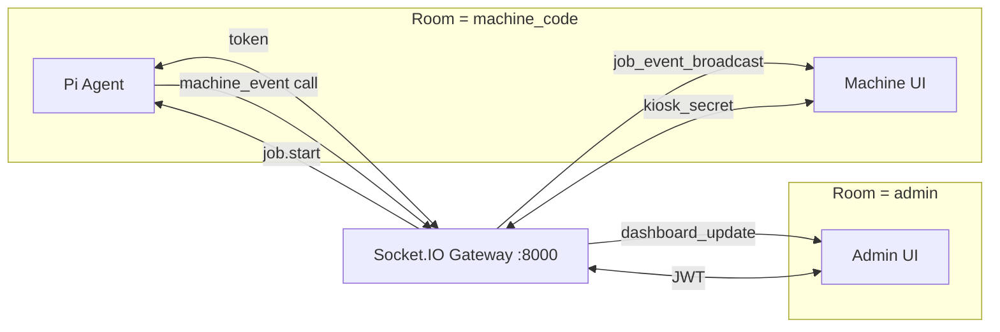
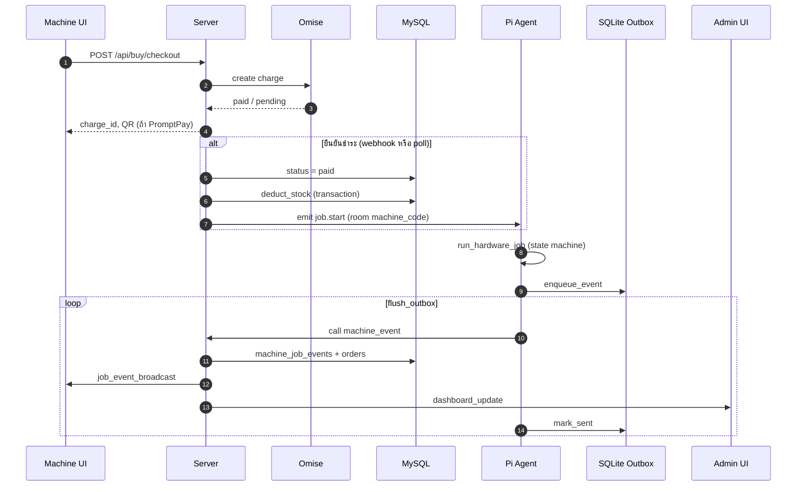

# Smart Vending — โฟลว์การทำงานทั้งระบบ

เอกสารนี้อธิบายการเชื่อมต่อระหว่างส่วนประกอบทั้งหมด รวมถึงระดับ Socket.IO (ใครต่อใคร, auth อะไร, event อะไร) และลำดับขั้นตอนตั้งแต่สมาชิก แอดมิน หน้าตู้ จนถึง Pi Agent

เอกสารที่เกี่ยวข้อง: [README2.md](../README2.md), [how-to-run.md](../how-to-run.md), [swagger.yaml](../swagger.yaml)

---

## สารบัญ

1. [ภาพรวมและพอร์ต](#1-ภาพรวมและพอร์ต)
2. [ศูนย์กลาง Socket.IO](#2-ศูนย์กลาง-socketio)
3. [ห้อง (Rooms) และประเภท Client](#3-ห้อง-rooms-และประเภท-client)
4. [ตาราง Event บน Socket](#4-ตาราง-event-บน-socket)
5. [Web UI สมาชิก (ไม่มี Socket)](#5-web-ui-สมาชิก-ไม่มี-socket)
6. [Admin UI](#6-admin-ui)
7. [Machine UI (หน้าตู้)](#7-machine-ui-หน้าตู้)
8. [Pi Hardware Agent](#8-pi-hardware-agent)
9. [โฟลว์ชำระเงินและจ่ายของ (ครบวงจร)](#9-โฟลว์ชำระเงินและจ่ายของ-ครบวงจร)
10. [State machine ฮาร์ดแวร์](#10-state-machine-ฮาร์ดแวร์)
11. [Bootstrap เมื่อเปิดเครื่อง](#11-bootstrap-เมื่อเปิดเครื่อง)
12. [การทดสอบมือ](#12-การทดสอบมือ)
13. [สิ่งที่ไม่ใช้ Socket](#13-สิ่งที่ไม่ใช้-socket)
14. [ตัวแปร Environment ที่ต้องคู่กัน](#14-ตัวแปร-environment-ที่ต้องคู่กัน)
15. [ไฟล์อ้างอิงหลัก](#15-ไฟล์อ้างอิงหลัก)

---

## 1. ภาพรวมและพอร์ต

ระบบมี **ศูนย์กลางเดียว** คือ `vending-server` (Flask) ที่รวม **REST API + Socket.IO** บนพอร์ตเดียวกัน (`server/main.py` → `make_socketio_app()`)

| ส่วน | Host (Docker มาตรฐาน) | โปรโตคอลหลัก |
|------|------------------------|---------------|
| MySQL | `localhost:3307` → container `:3306` | SQL |
| Server (API + Socket.IO) | `http://localhost:8000` | REST + WebSocket (Socket.IO) |
| Machine UI (Kiosk) | `http://localhost:3000` | REST → server, Socket.IO → server |
| Admin UI | `http://localhost:3001` | REST → server, Socket.IO → server |
| Web UI (สมาชิก) | `http://localhost:3002` | REST → server **เท่านั้น** |
| Pi Agent | `http://localhost:5000` | Socket.IO client → server; REST ภายใน Pi |



---

## 2. ศูนย์กลาง Socket.IO

**ไฟล์หลัก:** `server/app/realtime/socketio_gateway.py`

- สร้าง `socketio.Server(async_mode="eventlet")`
- ห่อ Flask ด้วย `socketio.WSGIApp` ใน `make_socketio_app()`
- ตอน `connect` แยก client 3 ประเภทจาก object `auth` ที่ส่งตอน handshake

การ dispatch งานจ่ายของใช้ **`emit_job_start` เท่านั้น** (ไม่มี REST ฝั่ง server สำหรับรับ telemetry จากตู้ — ดู `swagger.yaml`)

---

## 3. ห้อง (Rooms) และประเภท Client

### 3.1 Pi Hardware Agent (ทำให้ตู้ “ออนไลน์”)

| รายการ | ค่า |
|--------|-----|
| **Client** | `client/agent/ws_client.py` — `socketio.Client` |
| **URL** | `SERVER_SOCKET_URL` (เช่น `http://server:8000` ใน Docker) |
| **Transport** | `websocket` เท่านั้น |
| **Auth** | `{ "machine_code": "...", "token": "<MACHINE_TOKEN>" }` |
| **ตรวจสอบ** | bcrypt กับ `machines.secret_token_hash` ใน MySQL (`_verify_machine_token_auth`) |
| **Room** | `machine_code` (เช่น `MP1-001`) |
| **ผลหลัง connect** | `machines.is_online = 1`, บันทึก `_online_machines`, `dispatch_pending_jobs()`, ส่ง `machine_presence { online: true }` ไป kiosk ในห้องเดียวกัน |
| **หลัง disconnect** | `is_online = 0`, `machine_presence { online: false }` |

หลังเชื่อมต่อสำเร็จ Agent เรียก RPC `machine_ready` พร้อม `{ machine_code }` เพื่อ replay งาน `paid` ที่ค้าง

### 3.2 Machine UI (Kiosk — ฟังอย่างเดียว)

| รายการ | ค่า |
|--------|-----|
| **Client** | `web/machine-ui/src/hooks/useJobSocket.ts` — `socket.io-client` |
| **URL** | `NEXT_PUBLIC_SERVER_SOCKET_URL` หรือ fallback เป็น API URL (`getPublicSocketUrl()`) |
| **Auth** | `{ role: "kiosk", machine_code, kiosk_secret }` |
| **ตรวจสอบ** | `kiosk_secret` ต้องตรง `KIOSK_SOCKET_SECRET` บน server (`_verify_kiosk_auth`) |
| **Room** | `machine_code` เดียวกับตู้ |
| **ไม่ทำ** | ไม่ตั้ง `is_online` (ไม่นับเป็นตัวแทนฮาร์ดแวร์) |
| **รับ event** | `machine_presence`, `job.start`, `job_event_broadcast` |

### 3.3 Admin UI

| รายการ | ค่า |
|--------|-----|
| **Client** | `web/admin-ui/lib/admin-socket.ts`, `components/AdminSocketListener.tsx` |
| **URL** | `NEXT_PUBLIC_API_URL` / `http://localhost:8000`, path `/socket.io/` |
| **Auth** | `{ admin_token: "<JWT>" }` หรือ shared `ADMIN_SOCKET_SECRET` |
| **ตรวจสอบ** | decode JWT admin (`_verify_admin_auth`) |
| **Room** | `"admin"` (`ADMIN_ROOM`) |
| **รับ event** | `dashboard_update`, `admin_force_logout` |



---

## 4. ตาราง Event บน Socket

| ทิศทาง | Event / RPC | ผู้ส่ง | ผู้รับ | หมายเหตุ |
|--------|-------------|--------|--------|----------|
| Server → Pi | `job.start` | `emit_job_start()` | Agent handler ใน `ws_client.py` | หลังชำระเงิน + หักสต็อก |
| Pi → Server | `machine_event` (RPC `call`) | `flush_outbox()` | `@sio.event machine_event` | บันทึก DB + broadcast |
| Pi → Server | `machine_ready` (RPC) | หลัง `connect` | replay `dispatch_pending_jobs` | kiosk ถูก skip |
| Server → Kiosk | `job_event_broadcast` | หลัง ingest event | `useJobSocket` | อัปเดตจออุ่น/จ่าย |
| Server → Kiosk | `machine_presence` | connect/disconnect Pi | `useJobSocket` | `isAgentOnline` |
| Server → Kiosk | `job.start` | `emit_job_start` | `useJobSocket` (optional filter ตาม `activeJobId`) | |
| Server → Admin | `dashboard_update` | ทุก machine event | `AdminSocketListener` | ERROR → toast |
| Server → Admin | `admin_force_logout` | `admin_auth.py` | Admin UI | revoke session |

---

## 5. Web UI สมาชิก (ไม่มี Socket)

เชื่อม **HTTP REST** ไป server เท่านั้น (`web/web-ui`)

1. **ส่ง OTP** — `POST /api/auth/otp/send` → `otp_sessions`, SMS (หรือ dev bypass)
2. **ยืนยัน OTP** — `POST /api/auth/otp/verify` → JWT สมาชิก
3. **สมัคร / โปรไฟล์** — deferred registration (รายละเอียดใน README2 §5)
4. **คะแนน / แลกโปร** — `/api/members/...`
5. **สร้างคูปอง 8 หลัก** — เก็บใน DB → ลูกค้าพิมพ์ที่ตู้

**จุดเชื่อมกับตู้:** ไม่ใช่ socket แต่เป็นรหัสคูปองที่ Machine UI ส่ง `POST /api/buy/validate-coupon` ตอน checkout

---

## 6. Admin UI

### 6.1 REST

- Login → JWT เก็บ `localStorage` เป็น `admin_token`
- CRUD ตู้, สินค้า, ออเดอร์, คูปอง — `/api/admin/...`
- **สร้างตู้:** ได้ `MACHINE_CODE` + plaintext `MACHINE_TOKEN` (ครั้งเดียว) → ใส่ `.env` ของ Pi

### 6.2 Socket (real-time)

1. `getAdminSocket()` ต่อ server ด้วย JWT
2. Pi ส่ง telemetry → server `_insert_machine_event` → `emit_dashboard_update` → room `admin`
3. `state === "ERROR"` → toast + refresh alerts
4. Revoke admin → `admin_force_logout` → ลบ token, redirect `/login`

---

## 7. Machine UI (หน้าตู้)

**หน้าหลัก:** `web/machine-ui/src/app/page.tsx`

### 7.1 ก่อนชำระเงิน

| ขั้น | การเชื่อม | Hook / ไฟล์ |
|------|-----------|-------------|
| โหลดเมนู/สต็อก | REST | `useCart` |
| ตรวจตู้ busy | REST poll | `useMachineBusy` — order `paid` / `dispensing` / `pending_payment` |
| ตรวจ Agent online | Socket | `useJobSocket` → `machine_presence` |
| คูปอง | REST | `useCoupon` → validate |
| กดชำระ | เงื่อนไข | `isAgentOnline && !isMachineBusy` |

### 7.2 ชำระเงิน

**Hook:** `web/machine-ui/src/hooks/usePayment.ts`

1. `POST /api/buy/checkout` — Omise (บัตร / PromptPay / TrueMoney)
2. Poll `GET /api/buy/status/<charge_id>` หรือรอ webhook
3. Server ยืนยันยอด → `_execute_dispense` ใน `server/app/api/buy.py`

### 7.3 หลังชำระสำเร็จ

1. ตั้ง `chargeIdForSocket` → `useJobSocket({ activeJobId: charge_id })`
2. UI อุ่น/จ่าย — `useHeatingProcess` ฟัง `job_event_broadcast`
3. **ไม่** ต่อ socket ไป Pi `:5000` โดยตรง — ทุก event ผ่าน server

---

## 8. Pi Hardware Agent

**จุดเริ่ม:** `client/agent/agent.py`

1. `bootstrap_machine()` — GPIO, NFC, sensors
2. `start_ws_client()` — thread `connect_forever` → `SERVER_SOCKET_URL`
3. Flask `:5000` — REST `/jobs/start`, `/nfc/*` (ทดสอบ / NFC)

### 8.1 รับงาน `job.start`

`ws_client.py` → `job_manager.create_or_get` → `_run_mock_job` → `hardware_runner.run_hardware_job`

### 8.2 ส่ง telemetry (Outbox)

ทุก state เปลี่ยน → `job_manager.publish` → `enqueue_event` → SQLite (`client/agent/ws_outbox.py`)

Loop ~0.3s ใน `connect_forever`:

1. `get_pending()` จาก SQLite
2. `sio.call("machine_event", payload)` — รอ `{ ok: true }`
3. `mark_sent(job_id, seq)`

ถ้าเน็ตหลุด event ค้างใน outbox จน reconnect

### 8.3 Server หลังรับ `machine_event`

ใน `socketio_gateway._insert_machine_event`:

- INSERT `machine_job_events`
- อัปเดต `orders.status` (`dispensing` / `completed` / `dispense_failed`)
- **Done Guard:** ถ้ามี `DONE` แล้ว จะเพิกเฉย `ERROR` ที่ตามมา
- ERROR จริง → thread `_auto_refund` (Omise)
- `emit("job_event_broadcast", room=machine_code)`
- `emit_dashboard_update` → room `admin`

---

## 9. โฟลว์ชำระเงินและจ่ายของ (ครบวงจร)



### 9.1 `_execute_dispense` (สรุป)

ไฟล์: `server/app/api/buy.py`

1. `deduct_stock` — atomic, guard RC-6 / RC-7
2. `is_machine_agent_online(machine_code)` — ถ้า offline งานค้าง `paid` รอ replay
3. `emit_job_start(machine_code, job_id=charge_id, items=...)`
4. ถ้า emit ล้มเหลว → `dispense_failed` + refund

### 9.2 Replay งานค้าง

- ตอน Agent `connect` → `dispatch_pending_jobs()`
- ตอน `machine_ready` RPC (ไม่รับจาก kiosk sid)

เงื่อนไข order: `status = 'paid'`, มี `charge_id`, ยังไม่มีแถวใน `machine_job_events` สำหรับ `job_id` นั้น

---

## 10. State machine ฮาร์ดแวร์

```
[*] → TRANSFER_TO_OVEN  (job.start)
TRANSFER_TO_OVEN → HEATING
HEATING → DISPENSING
DISPENSING → DONE
DISPENSING / HEATING → ERROR (จริง)

DONE     → order completed
ERROR    → dispense_failed + auto-refund (ถ้าผ่าน guard)
```

Machine UI map state เหล่านี้ใน `useJobSocket` / `useHeatingProcess`

---

## 11. Bootstrap เมื่อเปิดเครื่อง

| ลำดับ | ส่วน | การทำงาน |
|-------|------|----------|
| 1 | Server | `eventlet.monkey_patch`, Flask + Socket.IO WSGI, background sweepers (`main.py`) |
| 2 | Pi Agent | hardware bootstrap + `start_ws_client()` + Flask :5000 |
| 3 | Machine UI | โหลด Next.js, `useJobSocket` singleton ต่อ server (kiosk auth) |
| 4 | Admin UI | หลัง login → `getAdminSocket()` |

---

## 12. การทดสอบมือ

- **POST** `http://localhost:5000/jobs/start` บน Agent — รัน job โดยตรง, telemetry ยังไป `machine_event` ผ่าน outbox เหมือน production
- Production checkout ใช้ **`emit_job_start` จาก server** เท่านั้น

---

## 13. สิ่งที่ไม่ใช้ Socket

| ส่วน | โปรโตคอล |
|------|----------|
| Web UI สมาชิก | REST |
| Omise | HTTPS จาก server |
| Omise.js บน Machine UI | สคริปต์ browser → Omise โดยตรง (tokenization) |
| Admin CRUD ส่วนใหญ่ | REST |
| Health check Agent จาก server | HTTP ไป `AGENT_BASE_URL` (ไม่ใช่ช่อง dispatch งาน) |

---

## 14. ตัวแปร Environment ที่ต้องคู่กัน

| คู่ | ฝั่ง |
|-----|------|
| `MACHINE_CODE` + `MACHINE_TOKEN` | Pi `.env` ↔ แถว `machines` ใน DB (token จาก Admin สร้างตู้) |
| `KIOSK_SOCKET_SECRET` ↔ `NEXT_PUBLIC_KIOSK_SOCKET_SECRET` | server ↔ machine-ui (build-time) |
| `NEXT_PUBLIC_SERVER_SOCKET_URL` | machine-ui → ชี้ server `:8000` |
| `SERVER_SOCKET_URL` | Pi → server |
| `admin_token` (JWT) | admin-ui ↔ server |
| `SOCKETIO_ENABLED=1` | ปิดได้ที่ server (ไม่แนะนำ production) |

---

## 15. ไฟล์อ้างอิงหลัก

| หัวข้อ | Path |
|--------|------|
| Socket.IO gateway | `server/app/realtime/socketio_gateway.py` |
| Checkout + dispense | `server/app/api/buy.py` |
| Server startup | `server/main.py` |
| Agent WS client | `client/agent/ws_client.py` |
| Agent outbox | `client/agent/ws_outbox.py` |
| Agent jobs / events | `client/agent/routes.py`, `client/agent/hardware_runner.py` |
| Machine UI socket | `web/machine-ui/src/hooks/useJobSocket.ts` |
| Machine UI payment | `web/machine-ui/src/hooks/usePayment.ts` |
| Admin socket | `web/admin-ui/lib/admin-socket.ts` |
| Admin listener | `web/admin-ui/components/AdminSocketListener.tsx` |
| Docker services | `docker-compose.yml` |
| เอกสารเชิงลึก (ไทย) | `README2.md` |

---

*อัปเดตตามโครงสร้าง repository ณ วันที่จัดทำเอกสาร — หาก API/event เปลี่ยน ให้ตรวจ `socketio_gateway.py` และ `swagger.yaml` เป็นหลัก*
